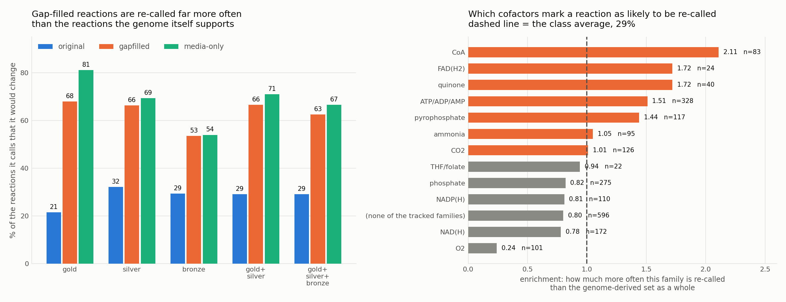

# Reaction-direction sources and what they do to models

*Ten direction sources from ModelSEED Biochemistry v2.0.1, applied to 5,683 core models and 5,420 genome-scale models*

## Summary

The same direction source has opposite effects on the two model sets. On the core models most sources **increase** the number that grow; on the genome-scale models most **abolish** growth entirely. That is not a property of the sources.

Two things produce it. The genome-scale networks are roughly fifteen times larger by distinct reaction count, so a source rewrites a far greater share of the network. And within that larger surface sit a few reactions that are thermodynamically uphill but biologically obligatory. One of them, the thiamine phosphomethylpyrimidine kinase, is present in every genome-scale model tested and on its own abolishes growth in 99% of them. The thermodynamic estimate for it is correct; the constraint derived from it is still wrong.

The practical consequence is that **the core panel cannot validate a direction source**. It exercises 239 of the 56,012 reactions in the database and omits the pathways where thermodynamic and biological direction diverge.

## 1. What was measured

**Baseline.** The bounds written in the model files themselves: forward, reverse or reversible according to each reaction's stored lower and upper bound. Nothing is recomputed. This is the *on-disk* row throughout, and it is what the models were gap-filled and published with.

**Applying a source.** A reaction whose SEED annotation appears in the source is rewritten to (0, 1000), (-1000, 0) or (-1000, 1000). A reaction the source does not mention keeps its on-disk bounds. Media are applied afterwards, biomass is the objective, and a model counts as growing above 1e-6.

| Model set | Models | Reactions / model | Distinct reactions | Media |
|---|---:|---:|---:|---|
| Core (core_kegg2) | 5,683 | 128 | 239 | 347-compound complete |
| Genome-scale (ms2_gsm) | 5,420 | 1,097 | 3,634 | 20-compound glucose minimal |
| Genome-scale (auxotrophy) | 5,420 | 1,085 | 3,484 | 51-compound auxotrophy |

Reactions per model is the median count of distinct ModelSEED reactions. The genome-scale models come from the public KBase workspaces of the ModelSEED v2 manuscript and were gap-filled on the media shown.

## 2. Genome-scale model properties

**The two media sets are genetically identical but gap-filled differently.** The same 5,420 genomes are reconstructed twice: once against glucose minimal media and again against auxotrophy media. Both sets have identical model IDs and start with the same genome-derived reactions, but gap-filling against different media adds different gap-filled reactions. This separation allows us to measure the effect of the medium on growth outcomes apart from the effect of direction sources.

**Gap-filled reactions differ between media but constitute <1% of total reactions.** Of the 3,634 distinct reactions in the glucose minimal models, 2,665 are genome-derived, 408 are gap-filled, and 696 are media-conditional (present in one medium only). Gap-filled reactions account for only ~0.6% of all reaction occurrences across a model, but they are re-called at much higher rates: 63% of gap-filled reactions are given new directions by the graded tier, versus only 29% of genome-derived reactions.

## 3. The ten sources

Three thermodynamic estimators, one LLM route, three evidence tiers and three cumulative tiers. A grade belongs to a *reaction*, not to a source: the release ships one grade per reaction and keeps the per-source table internal. A tier is therefore the release's recommended direction restricted to reactions at that tier, chosen by a fixed precedence of eQuilibrator over dGPredictor over group contribution.

| Source | Calls | Forward | Reverse | Reversible | Directional |
|---|---:|---:|---:|---:|---:|
| Group contribution | 19,246 | 10,514 | 1,423 | 7,309 | 62% |
| dGPredictor | 12,177 | 6,863 | 2,016 | 3,298 | 73% |
| eQuilibrator | 21,218 | 9,129 | 1,065 | 11,024 | 48% |
| LLM council | 44,850 | 38,945 | 2,350 | 3,555 | 92% |
| gold | 3,089 | 1,687 | 96 | 1,306 | 58% |
| silver | 16,150 | 6,065 | 922 | 9,163 | 43% |
| bronze | 8,875 | 4,179 | 1,300 | 3,396 | 62% |
| gold + silver | 19,239 | 7,752 | 1,018 | 10,469 | 46% |
| gold + silver + bronze | 28,114 | 11,931 | 2,318 | 13,865 | 51% |

No set contains an undecided call. A direction map is applied by rewriting bounds, and an undecided value would be applied as fully reversible, so emitting it for a reaction that was graded but could not be called would *remove* a constraint in the name of evidence. Absent means no opinion, and the model keeps its own bounds. **Directional** is the share of a source's calls that fix a direction rather than allow both: the constraint pressure it applies.

---

## 4. What each source does to growth


**Figure 1.** Share of models that grow under each direction source, against the bounds already in the model files. The three panels share a source ordering; each has its own baseline.

| Source | Core | Core Δ rxn | GSM glucose | GSM glucose Δ rxn | GSM auxotrophy | GSM auxotrophy Δ rxn |
|---|---:|---:|---:|---:|---:|---:|
| **on-disk baseline** | **3,461** | -- | **4,347** | -- | **5,399** | -- |
| Group contribution | 3,486 | 2,443 | 9 | 6 | 107 | 104 |
| dGPredictor | 3,806 | 3,364 | 0 | 0 | 0 | 0 |
| eQuilibrator | 3,948 | 3,311 | 0 | 0 | 515 | 515 |
| LLM council | 3,300 | 2,261 | 108 | 80 | 213 | 213 |
| gold | 3,339 | 2,890 | 2,502 | 1,328 | 4,618 | 4,291 |
| silver | 3,828 | 3,038 | 0 | 0 | 2,009 | 1,990 |
| bronze | 3,483 | 2,613 | 153 | 85 | 178 | 177 |
| gold + silver | 3,686 | 3,188 | 0 | 0 | 1,866 | 1,863 |
| gold + silver + bronze | 3,556 | 3,106 | 0 | 0 | 55 | 55 |

Models that grow, of 5,683 core and 5,420 genome-scale. Δ rxn shows the number of reactions with changed direction from on-disk bounds. Zero models failed to load in any run.

### On the core models, most sources help

eQuilibrator is the least directional source and gains the most models. **Gold alone costs growth while silver alone gains it**, which inverts the evidence hierarchy: 122 models stop growing under the best-graded directions and 367 start growing under the weaker ones. Gold calls 58% of its reactions directional against silver's 43%, and a directional call removes a degree of freedom the model was using. The grade measures how well an energy is known, not how safe it is to impose.

### On the genome-scale models, most collapse

On glucose minimal media **six of the ten sources leave zero growing models**. Every one returns an optimal solution with biomass flux zero, so these are genuine no-growth results rather than solver failures. The auxotrophy set starts from a near-complete baseline and separates the sources better: gold retains 85% of baseline, the silver-containing sets about a third, and six of eleven fall below 4%. The cumulative tiers decay monotonically there, 4,618 to 1,866 to 55.

"Nearly everything collapses" is fair for glucose minimal and an overstatement for auxotrophy. One detail runs the other way: among the models that do survive, mean growth flux *rises*, from 1.32 at baseline to 4.09 under gold and 6.52 under gold plus silver. Directional constraints remove futile cycling and channel flux, so the cost is concentrated entirely in the models that stop growing.

## 5. The grading, against the original thermodynamic sources


**Figure 2.** Left: how often an evidence tier and an estimator agree, over the reactions where both have an opinion. Right: the share of each source's calls that fix a direction rather than allow both.

**The tiers are largely eQuilibrator re-expressed.** The full graded set agrees with eQuilibrator on 99.52% of the 20,868 reactions they share, bronze at 100.0% and silver at 99.9%. That follows directly from the recommendation precedence putting eQuilibrator first. A tier behaves as a confidence filter on one source rather than as a consensus of several, so comparing a tier against eQuilibrator is close to comparing eQuilibrator against itself.

**The estimators disagree with each other more than the tiers suggest.** dGPredictor agrees with the gold tier on only 51.08% of the 2,596 reactions they share, barely above chance among three options. Gold is the tier where the evidence is strongest, so this is disagreement about well-measured reactions, not about hard ones.

**The LLM route is a different kind of claim.** The council agrees with eQuilibrator on 56.22% of 17,108 shared reactions; it reasons from the reaction rather than from an energy, which is the release's own argument for keeping it out of the grading.

The right panel of Figure 2 shows what the agreement numbers hide: the tiers are markedly *less committal* than the estimators they are drawn from. Silver allows both directions on 57% of its calls against dGPredictor's 27%. That is most of why the silver tier is gentler on the models than the source it mostly agrees with.

## 6. Why the genome-scale models collapse

A total collapse is as likely to be a defect as a result, so it was diagnosed rather than reported.

**The conversion is faithful.** Direction round-trips exactly from the KBase originals: 327,872 reactions across a 300-model random sample, 0 mismatches. The models also grow normally on their own bounds. Only the override breaks them.

**It is not the medium.** The collapse reproduces on the 347-compound complete medium, not only the 20-compound minimal one.

**It localises to individual reactions.** Taking one genome-scale model under eQuilibrator directions, 229 of its reactions differ from disk and 51 of those are constraining, but applying them one at a time shows that only three individually abolish growth. Repeating that scan across 73 models that all grow at baseline, every one has at least one individually lethal constraint, and the distribution is extremely skewed.


**Figure 3.** Share of tested genome-scale models in which constraining one reaction alone abolishes growth. Rates are from a 73-model scan and shift by a few points between samples; the ranking of the first does not.

**One reaction explains most of it.** The thiamine phosphomethylpyrimidine kinase (rxn03108) is present in every genome-scale model and lethal in 72 of 73. On-disk direction: reversible (=). eQuilibrator: reverse (<), computing +15.59 kcal/mol. That number is not wrong: the phosphoryl transfer is uphill in isolation. But the enzyme is an ATP-driven kinase in thiamine biosynthesis and must run forward, so constraining it to the thermodynamically favoured direction removes thiamine and with it biomass. LLM council calls it forward (>) instead, reasoning from biology. Silver also calls it reverse and amplifies the collapse.

ATP sulfurylase (rxn00379) is the same failure with better evidence: on-disk direction reversible (=), graded **gold** from an openTECR measurement, +11 kcal/mol. Called reverse by eQuilibrator (<), dGPredictor (<), and gold tier (<). In the cell it runs forward because pyrophosphatase removes the pyrophosphate product. The measurement is right and the direction call is right in isolation; the constraint is still wrong. It is a milder case, present in 67% of models and lethal in about one in eight of those.

Removing the top three reactions from the eQuilibrator map restores 137 of 381 growers in a 480-model sample, from zero. The collapse is not diffuse over-constraint; it is a handful of obligatory, cofactor-driven reactions.

**Why the core models escape.** They contain 239 distinct reactions against 3,634. Thiamine biosynthesis and sulfate assimilation are simply absent from a core carbon-metabolism model, so the reactions that kill the genome-scale models are never touched. Accordingly, the core models show no single-reaction collapse pattern: even eQuilibrator loses only 487 models (14%) and dGPredictor loses 345 (10%), versus 5,420 genome-scale models (100%) on glucose minimal. The collapse is entirely a function of larger networks encountering obligatory reactions that the thermodynamic estimates misclassify.

**Why gold alone helps but gold+silver kills on glucose minimal.** Gold constrains only the most confident reactions (58% are directional), and it avoids the worst cofactor-driven reactions that lack measurements. On glucose minimal, gold retains 2,502 growers (58% of baseline). Silver contains many lower-confidence calls, notably on CoA chemistry and membrane redox families where the evidence is weak. The core failure case — thiamine phosphomethylpyrimidine kinase (rxn03108) — receives different calls: eQuilibrator marks it reverse (call: <), silver inherits that reverse call, but gold does not mention it (no measurement, no call). Adding silver to gold adds 642 new overrides per model on average and includes the reverse calls on the lethal reactions. On auxotrophy media (where the baseline is 5,399 and includes more thiamine), gold + silver retains 1,866 growers (35%), a steep loss but not total collapse, because the auxotrophy medium supplies thiamine and relaxes the constraint somewhat.

**Reaction rxn03108 (thiamine phosphomethylpyrimidine kinase) in the sources.** Gold: not called (no measurement). Silver: reverse. Bronze: not shown. eQuilibrator: reverse (+15.59 kcal/mol, thermodynamically justified). LLM council: forward (both council and Claude 3.5 call this forward, reasoning from its role in biosynthesis rather than from isolated energy).

## 7. Gap-filled reactions, and which ones get re-called

The genome-scale models exist twice: the same 5,419 genomes reconstructed once and gap-filled against glucose minimal media, and again against auxotrophy media. Comparing the pair separates what the genome supports from what gap-filling added. A reaction present in **both** models and gap-filled in **neither** is genome-derived; one carrying gap-fill data in either is gap-filled; one present in only one of the pair is conditional on the medium and is reported separately.

| Provenance | Distinct reactions | Occurrences | What it is |
|---|---:|---:|---|
| original | 2,665 | 5,461,785 | in both media models, gap-filled in neither |
| gapfilled | 408 | 22,185 | carries gapfill data in either model |
| media-only | 696 | 18,646 | present in one media model, absent from the other |

Gap-filled and media-conditional reactions are numerous as distinct identifiers but rare as occurrences: together they are under 1% of all reaction instances. Most of any given model is genome-derived.



**Figure 5.** Left: the share of the reactions a tier calls that it would change, split by provenance. Right: which cofactor families mark a genome-derived reaction as likely to be re-called, as enrichment against the 29% class average.

**Gap-filled reactions are re-called two to three times as often.** Of the genome-derived reactions the full graded set has an opinion about, it would change 29%. Of the gap-filled ones it would change 63%, and of the media-conditional ones 67%. Gold alone is starker still: 21% of genome-derived against 68% of gap-filled.

That is what you would expect if gap-filling picks directions to make a model grow rather than to match the thermodynamics, and it is a second reason the genome-scale models are more fragile than the core ones under a direction override: the override is disproportionately aimed at the reactions the reconstruction added on purpose. It also connects to the mechanism in section 5, where the second most lethal reaction, the 3'-phosphoadenylyl-sulfate sulfohydrolase, is itself gap-filled.

### Which cofactors mark a reaction as likely to be re-called

The prediction going in was that the modified reactions would concentrate in ATP, NAD and NADP chemistry. Half of that holds. Raw shares are misleading here, because a family that appears in many reactions will appear in many modified reactions; what matters is the rate among the reactions a tier actually calls.

| Cofactor family | Called | Modified | Rate | Enrichment |
|---|---:|---:|---:|---:|
| CoA | 83 | 51 | 61.4% | 2.11 |
| FAD(H2) | 24 | 12 | 50.0% | 1.72 |
| quinone | 40 | 20 | 50.0% | 1.72 |
| ATP/ADP/AMP | 328 | 144 | 43.9% | 1.51 |
| pyrophosphate | 117 | 49 | 41.9% | 1.44 |
| ammonia | 95 | 29 | 30.5% | 1.05 |
| CO2 | 126 | 37 | 29.4% | 1.01 |
| phosphate | 275 | 66 | 24.0% | 0.82 |
| NADP(H) | 110 | 26 | 23.6% | 0.81 |
| NAD(H) | 172 | 39 | 22.7% | 0.78 |
| O2 | 101 | 7 | 6.9% | 0.24 |

Genome-derived reactions only, under gold + silver + bronze. Enrichment is the family's modification rate over the 29.1% class average; tags overlap, since a reaction can use several cofactors.

**ATP is enriched, but NAD and NADP are not.** ATP chemistry is re-called 1.5 times more often than average and pyrophosphate 1.4 times, which matches the mechanism in section 5: these are the reactions driven by cofactor hydrolysis rather than by their own free energy. But NAD(H) sits at 0.78 and NADP(H) at 0.81, meaning both are re-called **less** often than average. Nicotinamide redox potentials are well characterised and consistently estimated, so the sources mostly agree with the reconstruction about them.

**The strongest signal was not predicted at all.** CoA chemistry is re-called at 61%, more than twice the class average, and the two membrane redox families follow at 1.7 times. Thioester hydrolysis is strongly favourable in isolation while the cell routinely runs it biosynthetically, and quinone potentials are the known weak point of the estimators. Oxygen chemistry is the opposite case: re-called at 6.9%, almost never, because a reaction consuming O2 is unambiguously downhill and every source agrees.

This supports the idea of fixing groups rather than reactions, but it redirects it. The groups worth a rule are **CoA thioesters, quinone and FAD redox, and ATP or pyrophosphate coupling** -- together 568 of the 1,706 genome-derived reactions the graded set calls. A rule exempting NAD and NADP chemistry would target reactions the sources already get right.

## 8. Does anything predict what a source will do?


**Figure 4.** Share of reaction occurrences a source changes, against the share of models that grow. Note the independent vertical scales: the core panel spans 51-70%, the genome-scale panel 0-80%.

Not reliably. Of the candidate summary statistics -- directional fraction, reactions called, occurrences changed, overrides per model -- none is significant on the core panel, and the best on the genome-scale panel reaches only Spearman rho of -0.65. The share of occurrences a source changes gives rho = -0.65 on glucose minimal, -0.45 on auxotrophy and -0.03 on the core panel, where it has essentially no ordering power at all.

Directional fraction does better on the core panel, rho = -0.68, but only when computed over the whole release. Restricted to the 239 reactions the core models actually contain -- the ones that can affect the result -- it falls to -0.28 and is not significant. The ten sets are also nested rather than independent: gold sits inside gold plus silver, which sits inside gold plus silver plus bronze.

Two counterexamples make the point concretely. Bronze changes *less* of the network than gold, 3.3% against 3.7%, and retains far less growth. dGPredictor changes only 12.5% and leaves zero growers. **What a source does depends on which reactions it constrains, not how many.**

## 9. What follows

**A direction source cannot be validated on the core models.** They exercise 239 of 56,012 reactions and omit the pathways where thermodynamic and biological direction come apart. Earlier conclusions drawn from that panel are not contradicted so much as shown to be untested.

**A grade is not a licence to constrain.** The grading scheme answers how well an energy is known, and answers it well: ATP sulfurylase is gold because openTECR measured it. Whether it is safe to fix that reaction's direction in a model is a different question, and the two come apart precisely at the cofactor-driven reactions. A tier used as an FBA constraint set needs a second filter for obligatory reactions.

**Reversibility is the safe default.** Every set that is more than about 60% directional damages the genome-scale models badly. That is a tendency rather than a rule, but it is the most robust one available.

**Two candidate fixes, neither tested here.** Exempt reactions whose stoichiometry contains ATP or pyrophosphate hydrolysis from directional constraint, which is the mechanism in every case examined; or intersect a tier with the LLM council and keep only reactions where both agree, trading coverage for safety.

## 10. Caveats

**Growth is the only readout.** A direction set that preserves grower count may still distort flux distributions; nothing here measures that.

**Energy-generating-cycle detection does not work on these models.** The existing probe closes every biomass reaction above ten metabolites and relies on a smaller one staying open as an ATP probe. The genome-scale models have exactly one biomass and no maintenance reaction, so it would report zero cycles for all 5,420 with no error.

**The lethal-reaction scan covers 73 models**, the growers among every 60th of the set. The ranking of the first reaction is unambiguous and replicated on an independent sample; the long tail is not fully enumerated.

**Correlations rest on ten non-independent sets.** No coefficient here exceeds 0.7 in magnitude and most are not significant.

## Reproducing this

```bash
python3 scripts/build_direction_sets_v201.py
python3 beginPipeline --models core_kegg2 --workers 64 \
    --directions v201_gold ... --only growth,growth_diff \
    --out results/influence_v201/core_all
python3 scripts/analyze_direction_coverage.py
python3 scripts/regen_figures.py direction_influence
python3 scripts/build_influence_report.py
```

Results are under results/influence_v201/ and results/direction_sets_v201/, each run with a run.json recording the exact command. Every number in this document is read from those files at build time, and the PDF and Markdown renderings come from one content definition in scripts/build_influence_report.py.

