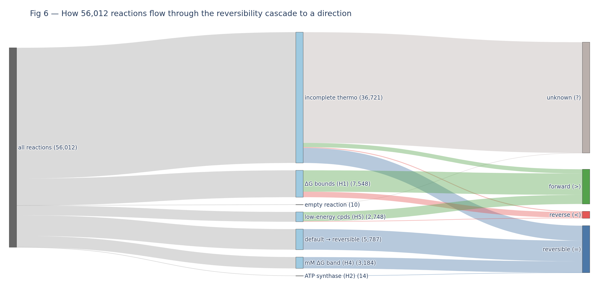
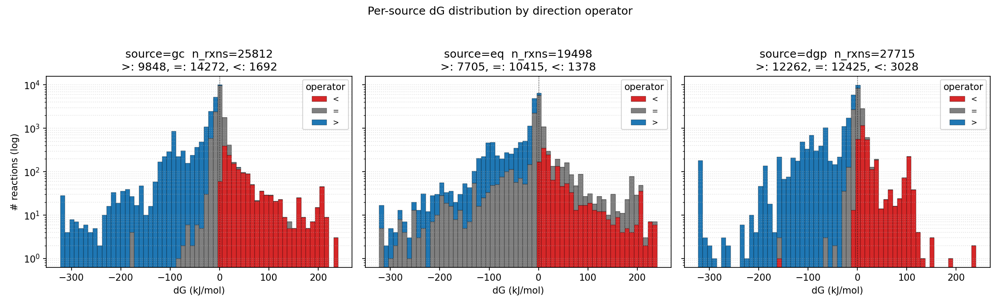
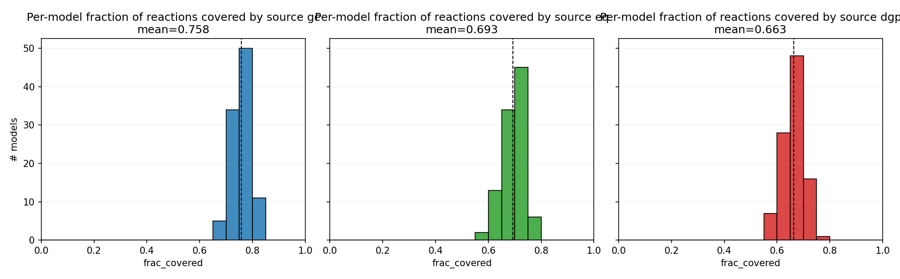
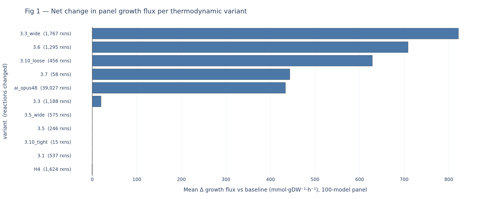

# Methods and Results

*Environment: Python 3.12.13 (Ubuntu 24.04.4 LTS, Linux 6.17); COBRApy 0.31.1,
ModelSEEDpy 0.4.2, KBUtils_Local 0.1.0, pandas 2.3.3, NumPy 2.4.6, SciPy 1.18.0,
Matplotlib 3.10.9, JupyterLab 4.5.7; RDKit + eQuilibrator-API 0.7.0 in an isolated
environment for Component Contribution calls and identity matching; Plotly 6.8.0 +
Kaleido for figures.*

## Methods

### Overview of pipeline

The analysis runs as ten cache-backed Jupyter notebooks over the 5,683
KBase-format models in ModelSEED's `core_models_kegg2` (Henry et al., 2010),
each consuming artifacts from the last. Notebooks 01–05 build the baseline:
genome-scale FBA on ModelSEED complete media (3,461/5,683 growers), grower
characterization, gap analysis, and a 100-model diverse panel used for every
downstream comparison. Notebooks 06–10 form the thermodynamic core: a
parameterizable port of ModelSEEDDatabase's reversibility heuristics (06), a
reaction-direction-driven growth pipeline comparing on-disk bounds to MSDB
(09), and a four-way thermodynamics-source comparison (10).

### Structure determination and compound energies (heuristics)

Every non-heuristic ΔG source needs a compound-identity bridge from
ModelSEED's internal `cpd` IDs to an external structure. Each compound's
SMILES is converted to a canonical InChIKey (RDKit) at two tiers —
`stereo_exact` (charge-neutralized, stereochemistry-preserving) and a
`skeleton` fallback (connectivity only) — then cross-walked via
KEGG/ChEBI/BiGG/MetaNetX accessions where available. Against eQuilibrator
3.0's library this resolves 17,071–18,559 ModelSEED compounds depending on
tier strictness. Group contribution (Jankowski et al., 2008) instead sums
per-fragment contributions directly from ModelSEED structures, propagating
uncertainty in quadrature, and fails all-or-nothing if any fragment is
undefined.

### Reaction completion and reaction energies (heuristics)

A reaction receives a source-derived ΔrG′° only if *every* participating
compound has an energy from that source ("reaction completion") — a strict
AND over stoichiometry, so partial metabolite coverage silently truncates
reaction coverage. We apply this gate identically across the historical
group-contribution fallback, two eQuilibrator variants (a static
MSDB-bundled `Flamholz_2012` snapshot and a live `Beber_2022` eQuilibrator
3.0 call), and dGPredictor, a fragmentation/ML method (Wang, Upadhyay &
Maranas, 2021), recomputing ΔrG′° at pH 7, I = 0.25 M, 298.15 K throughout.

### Estimation of reaction reversibility

MSDB assigns each reaction one of four calls (`>`, `<`, `=`, `?`) via an
ordered cascade descending from Henry, Broadbelt & Hatzimanikatis (2007):
ATP-synthase and ABC-transporter structural patterns first, then a stored
ΔG′° window, then a low-energy-compound points rule, defaulting to
reversible (Fig. 1). Porting this line-for-line and working with Claude
(Opus 4.8), we (1) found and fixed two variable-shadowing bugs that
silently disabled the O₂/H₂ concentration override and the ABC-transporter
phosphate rule, affecting 1,992/56,012 reactions and flipping 621 core
models grower→non-grower; (2) reordered the cascade to check structural
rules before the generic ΔG window (44 reactions, all ATP-synthase/ABC
cases); (3) evaluated and rejected a fifth call separating "no rule fired"
from "reversible" (zero effect on FBA bounds, so removed); and (4) added a
statistics layer the original point-estimate cascade lacks entirely: an
analytic P(direction) from the Component-Contribution ΔG′° uncertainty, and
a Monte Carlo resampler propagating that uncertainty through the full
cascade into panel-level growth distributions.

## Results

### Compound energies from different heuristics

Per-model compound-energy coverage on the 100-model panel averages 0.758
under group contribution, 0.693 under eQuilibrator, and 0.663 under
dGPredictor (Fig. 2) — direct structural summation covers more compounds
than either literature-anchored alternative. Validated independently
against 802 TECRDB stereo-exact matches, a ModelSEED-structure-retrained
dGPredictor (Freiburger) reaches MAE 5.8 kJ/mol / RMSE 12.3 / r = 0.74,
versus 9.4 / 26.1 / 0.39 for the original KEGG-trained model — a broad gain
concentrated in suppressed outliers. It is not uniformly better: it
confidently mispredicts glutathione-disulfide reductase (+101.6 vs. an
experimental +11.9 kJ/mol, ±3.7 uncertainty), a case both the original
model and eQuilibrator get right, suggesting a disulfide/thiol-redox blind
spot introduced by retraining.

### Reaction energies from different heuristics

Reaction completion is stricter than compound coverage: requiring every
reactant to resolve retains 25,812/56,012 reactions (46%) under group
contribution and 27,715 (49%) under dGPredictor, but only 19,498 (35%)
under eQuilibrator (Fig. 3) — richer per-compound identity does not
translate into broader reaction coverage. On the 100-model panel this
yields mean growth flux of 52.16 (GC), 46.12 (dGPredictor) and 63.77
(eQuilibrator) mmol/gDW/h, all above the 38.39 on-disk baseline, with
≥94/100 growers retained throughout. Critically, on-disk bounds agree with
MSDB's own thermodynamically computed direction only 66.43% of the time;
the remaining 33.57% is a silent disagreement present in every one of the
100 panel models, not an edge case — the "original" models are already
running on a direction map that partly diverges from their own database's
thermodynamics.

### Reaction reversibility

Under the fixed, reordered cascade, all 56,012 EQ-level ModelSEED reactions
resolve to 9,751 forward-only, 1,957 reverse-only, and 13,202 reversible;
the remaining 31,102 (55.5%) stay unknown, mostly because at least one
participating compound lacks any source energy. Propagating
Component-Contribution uncertainty through the cascade (analytic
P(direction), N=50 Monte Carlo resampling) shows the ±2 kcal/mol reversible
band conflates two different things: of 142 panel reactions the cascade
calls reversible, 95 (67%) are in fact >95%-confident of a single sign once
uncertainty is modeled — "reversible" more often means "confidently
near-zero on one side" than "genuinely unknown."

### Impact of thermodynamics on metabolic modeling

Ranking eighteen configurations by mean panel Δflux relative to the on-disk
baseline (Fig. 4) makes the sources directly comparable. eQuilibrator
(Beber 2022) and dGPredictor produce nearly identical average lift (+17.1
and +17.3 flux units) despite disagreeing reaction-by-reaction —
eQuilibrator changes 7,647 directions with zero grow/no-grow flips,
dGPredictor changes 15,623 with one. The LLM (Claude Opus 4.8) is the
outlier among these three full-direction-source replacements: the smallest
average lift (+5.8) but the most disruption to model viability (41/100
panel models flip grow status, vs. 0 for eQuilibrator and 1 for
dGPredictor) — consistent with its comparatively conservative peak-growth
lift in an independent template-evaluation check (Opus +11.1 vs.
Jankowski's group contribution +54.0 and Flamholz's eQuilibrator +33.9).
Concentration-aware corrections push the opposite way: a best-evidence
composite of tightened confidence, per-metabolite concentration ranges
(Bennett et al., 2009) and the reversibility index (Noor et al., 2012)
collapses the panel from 100/100 always-growing models to 26 always-growing,
53 never-growing, and 21 uncertain — the single largest reframing of model
viability found in this project, and a reminder that today's default
heuristic cascade may be systematically optimistic about growth.

## References

- Henry, C. S., DeJongh, M., Best, A. A., Frybarger, P. M., Linsay, B.,
  Stevens, R. L. "High-throughput generation, optimization and analysis of
  genome-scale metabolic models." *Nature Biotechnology* 28(9): 977–982,
  2010. doi:10.1038/nbt.1672.
- Henry, C. S., Broadbelt, L. J., Hatzimanikatis, V. "Thermodynamics-based
  metabolic flux analysis." *Biophysical Journal* 92(5): 1792–1805, 2007.
  doi:10.1529/biophysj.106.093138.
- Jankowski, M. D., Henry, C. S., Broadbelt, L. J., Hatzimanikatis, V.
  "Group contribution method for thermodynamic analysis of complex
  metabolic networks." *Biophysical Journal* 95(3): 1487–1499, 2008.
  doi:10.1529/biophysj.107.124784.
- Noor, E., Haraldsdóttir, H. S., Milo, R., Fleming, R. M. T. "Consistent
  estimation of Gibbs energy using component contributions." *PLOS
  Computational Biology* 9(7): e1003098, 2013. doi:10.1371/journal.pcbi.1003098.
- Beber, M. E., Gollub, M. G., Mozaffari, D., Shebek, K. M., Flamholz, A. I.,
  Milo, R., Noor, E. "eQuilibrator 3.0: a database solution for
  thermodynamic calculation in biochemical and synthetic biology." *Nucleic
  Acids Research* 50(D1): D603–D609, 2022. doi:10.1093/nar/gkab1106.
- Noor, E., Haraldsdóttir, H. S., Liebermeister, W., Milo, R. "The
  Reversibility Index" (thermodynamic reversibility index γ), as implemented
  in the eQuilibrator toolchain, 2012.
- Bennett, B. D., Kimball, E. H., Gao, M., Osterhout, R., Van Dien, S. J.,
  Rabinowitz, J. D. "Absolute metabolite concentrations and implied enzyme
  active site occupancy in Escherichia coli." *Nature Chemical Biology* 5:
  593–599, 2009. doi:10.1038/nchembio.186.
- Wang, L., Upadhyay, V., Maranas, C. D. "dGPredictor: Automated
  fragmentation method for metabolic reaction free energy prediction and
  de novo pathway design." *PLOS Computational Biology*, 2021.
