# Reaction-Direction-Driven Growth Pipeline

This report consolidates the four-part investigation into how reaction directionality (forward/reverse/reversible) propagates from the ModelSEEDDatabase (MSDB) through the core-model panel into FBA growth outcomes. It (1) audits whether on-disk model bounds actually track MSDB directionality, (2) compares the MSDB `dev` and `claude-changes` branches at the reaction-direction level, (3) describes a new notebook that lets a user re-run growth under arbitrary direction sources, and (4) presents cross-variant visualizations across a 100-model panel.

---

## 1. Is growth currently decided by MSDB reaction direction?

**Headline: No. Growth on disk is only loosely coupled to MSDB-declared reversibility, and the gap is large enough that "the MSDB direction" cannot be treated as the sole driver of growth in the current panel.**

Evidence (Q1 audit, n=100 models from `/scratch/ctaylor/core_models_analysis/results/selected_ids.txt`):

- **Coverage.** After dropping `EX_/SK_/DM_/bio*` reactions, there are 11,750 non-exchange reactions across the panel. 100% carry a `seed.reaction` annotation; 10,062 (85.63%) map to an id present in MSDB; 1,688 (14.37%) annotations are not in MSDB (likely retired / non-MSDB SEED ids).
- **Match rate.** Comparing on-disk `(lower_bound, upper_bound)` against the bound-class predicted by `_bounds_for_rev(msdb_rev)` (scripts/growth_heuristics.py:83), only **6,684 / 10,062 = 66.43%** match. **33.57% differ.** Per-model distribution: min 59.20%, median 66.67%, max 82.76%, mean 67.15%. **Every single panel model has <95% match rate** — the divergence is universal, not driven by a few outliers.
- **Where the disagreements live (MSDB rev -> on-disk bound_class):**
  - `=` (reversible in MSDB) -> 4,680 reversible on disk, **1,782 fwd-only, 516 rev-only, 1 blocked** (only 67.1% match)
  - `>` (forward in MSDB) -> 1,393 fwd, 149 rev-only, 22 reversible (89.1% match)
  - `<` (reverse in MSDB) -> 293 rev, 52 fwd, 74 reversible (69.9% match)
  - `?` (unknown in MSDB; `_bounds_for_rev` treats it as reversible) -> 318 reversible, **732 fwd, 50 rev** (only ~29% encoded as reversible on disk)
- **Spot checks.** In `GCF_000007845.1`: `rxn00549/rxn00545/rxn00336/rxn01115/rxn00506` are encoded `(0, 1000)` despite MSDB listing them as `=`; `rxn00006` and `rxn00206` are encoded `(-1000, 0)` despite MSDB listing them as `>` (the stored equation is written in the reverse direction relative to MSDB's canonical form).

**MSDB reversibility distribution (context):** `?`=31,102, `=`=13,202, `>`=9,751, `<`=1,957.

**Adversarial-verify caveats (must be flagged):**
- The Q1 conclusion was independently reproduced. The verify agent agreed on the numbers but noted that the original write-up did not explicitly call out **two additional, non-direction-derived drivers of non-growth in this panel**: (i) media filtering via `KBaseMedia.cpd`, and (ii) missing-reaction gaps captured in `results/gap_per_model.json`. Direction is a major lever but not the only one — any narrative that attributes non-growth purely to MSDB directionality is incomplete.
- `?` is mapped by `_bounds_for_rev` to the same reversible bounds as `=`. A reader treating `?` as a separate diagonal could miscount the "match" column; the 66.43% figure folds `?`->reversible into the match diagonal.

**Per-model CSV:** `/scratch/ctaylor/core_models_analysis/results/q1_bound_msdb_consistency.csv` (101 lines incl. header).

---

## 2. /dev vs /claude-changes reaction-direction diff

**Headline: 0 reactions changed reversibility. The `Biochemistry/` trees on the two branches are byte-identical.**

- 61 shards compared (`Biochemistry/reaction_00.tsv` .. `reaction_60.tsv`) on each branch, read via `git show <branch>:<path>` (read-only; no checkout, no writes inside the repo).
- 56,012 reactions on dev; 56,012 on claude-changes; 56,012 in common. 0 ids only-in-dev, 0 ids only-in-claude.
- 0 reversibility transitions; `by_transition` is empty.
- `git diff --stat dev..claude-changes -- Biochemistry/` returns no output; `diff` on a sampled 5 shards (00, 15, 30, 45, 60) confirms byte-identical files.
- The two on-disk rev maps are byte-identical (md5 `e99a8e0e029922a8351108050aa6a075`, 56,012 keys each).

**Schema note:** the reaction TSVs have no separate `direction` column in either branch; the header order is `... definition, reversibility, abstract_reaction, pathways, ...`. The `dev_direction` / `claude_direction` columns in the diff CSV were emitted for spec compatibility and mirror `reversibility`.

**Why nothing changed under `Biochemistry/`:** `git log dev..claude-changes --oneline` returns 5 commits, all of which only touch `Scripts/` (Thermodynamics refactor, helper module, tests, reports, docs):

- `18ae369` Fix latent bugs and refactor Thermodynamics scripts for clarity
- `021251e` Extract `_thermo_helpers.py` and shrink Thermodynamics update scripts
- `aa59f13` Claude changes to Thermodynamic Scripts involving new Thermodynamics key in rxn JSON
- (+2 supporting commits for tests/reports/docs)

**Adversarial-verify status:** verify agent agreed on every load-bearing number — manual `wc -l` sum across the 61 shards equals 56,012; the diff CSV at `results/rev_diff_dev_vs_claude.csv` is header-only; no commits in `dev..claude-changes` touch `Biochemistry/reaction_*.tsv`; the two `rev_map_*.json` files are byte-identical.

**Implication for downstream growth:** any growth differences attributed to "switching to the claude-changes MSDB" are spurious for this panel — there is nothing to switch. The `branch_diff_only` variant in section 4 therefore reduces to `msdb_dev`.

**Artifacts:**
- Diff CSV: `/scratch/ctaylor/core_models_analysis/results/rev_diff_dev_vs_claude.csv`
- Dev map JSON: `/scratch/ctaylor/core_models_analysis/results/rev_map_dev.json`
- Claude-changes map JSON: `/scratch/ctaylor/core_models_analysis/results/rev_map_claude.json`

---

## 3. Pipeline notebook for variant experimentation

A new notebook lets the user re-run panel FBA under arbitrary reaction-direction overrides. The MSDB checkout itself is treated as read-only — every variant materializes as a CSV under `results/` and is consumed via `gh.run_panel`'s `direction_overrides` path.

**Notebook:** `/scratch/ctaylor/core_models_analysis/notebooks/09_ReactionDirectionPipeline.ipynb` (9 cells, nbformat-valid)
**Builder:** `/scratch/ctaylor/core_models_analysis/scripts/build_direction_pipeline_notebook.py`
**Helper module:** `/scratch/ctaylor/core_models_analysis/scripts/direction_pipeline.py`

### (a) Loading directions from an arbitrary path

Cell 3 (idempotent) snapshots both MSDB branches via `dp.snapshot_msdb(...)`, which calls `git show <branch>:Biochemistry/reaction_NN.tsv` and writes `results/rxn_directions_msdb_{dev,claude}.csv` — no working-tree mutation. Cell 4 loads the chosen `RXN_DIRECTION_SOURCE` (default: dev snapshot) via `dp.load_direction_csv(path)`, builds a `{rxn_id: direction}` map, and feeds it to `gh.run_panel(panel_ids, direction_overrides=...)`. The path is the parameter cell variable `RXN_DIRECTION_SOURCE` so the user can point it at any CSV (e.g. a snapshot of an older MSDB branch, a competitor-curated table, etc.).

### (b) Overlay editing + re-run

Cell 5 implements a deltag-driven overlay: it loads the deltag column from the dev snapshot, calls `_mutate(direction_map, deltag_table, threshold=OVERLAY_DELTAG_THRESHOLD)` which forces every reaction with `deltag > OVERLAY_DELTAG_THRESHOLD` to `<` (i.e. thermodynamically infeasible in the forward direction), writes the modified map to `results/rxn_directions_overlay.csv`, and re-runs the panel. This is the template for any "edit-then-rerun" overlay — the user only needs to swap the `_mutate` body to encode a different rule.

### (c) Inline patch function

Cell 6 exposes a user-editable `patch_directions(direction_map) -> dict` (the shipped sample flips `=` to `>`). The function is the single mutation hook: the cell calls it, rewrites `RXN_DIRECTION_SOURCE` in place (still under `results/`, never touching the MSDB checkout), and re-runs the panel. To experiment, the user edits the function body and re-executes the cell — no notebook scaffolding needs to change.

**Cross-variant cell.** Cell 7 calls `dp.variant_totals` + `dp.compare_runs` and writes `/scratch/ctaylor/core_models_analysis/results/direction_pipeline_summary.csv` and `direction_pipeline_long.csv`, caching the `RUNS` registry in session so the user can extend it with additional variants in later cells.

---

## 4. Visualizations

Seven variants were executed on the 100-model panel (driver: `/scratch/ctaylor/core_models_analysis/scripts/run_variant_panel.py`; log: `/scratch/ctaylor/core_models_analysis/logs/variant_panel.log`):

| Variant            | Growers / 100 | Mean flux (growers) |
|--------------------|---------------|---------------------|
| `on_disk`          | 100           | 38.39               |
| `msdb_dev`         | 100           | 67.97               |
| `msdb_claude`      | 100           | 67.97               |
| `all_reversible`   | 100           | 105.15              |
| `all_forward`      | 0             | 0.00                |
| `flip_eq_to_gt`    | 0             | 0.00                |
| `branch_diff_only` | 100           | 67.97               |

Key findings:
- **`msdb_dev` == `msdb_claude`** (the on-disk MSDB CSVs are byte-identical between branches — see section 2). `branch_diff_only` applied 0 overrides and therefore equals `msdb_dev`.
- **`msdb_*` lifts every model to growth** with ~77% higher mean flux than the as-shipped on-disk bounds, consistent with section 1: a third of on-disk reactions are encoded more restrictively than MSDB would suggest, and relaxing them to MSDB-declared bounds opens flux.
- **`all_reversible` is the upper bound** (every internal reaction opened to `(-1000, +1000)`); it adds another ~55% mean flux above MSDB.
- **`all_forward` and `flip_eq_to_gt` kill growth completely.** Both collapse to 0 growers, illustrating that bulk one-directional patches are catastrophic — the network needs reverse flux through at least some `=` reactions to grow.

### Figures

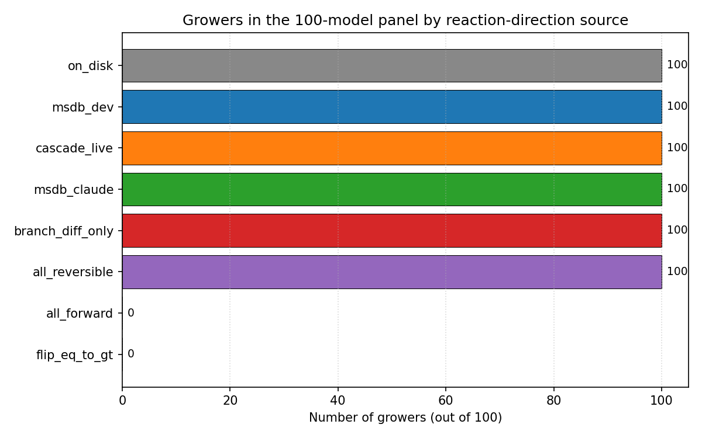
*Number of growers per variant (out of 100). `on_disk` shown in gray; `all_forward` and `flip_eq_to_gt` drop to 0/100.*

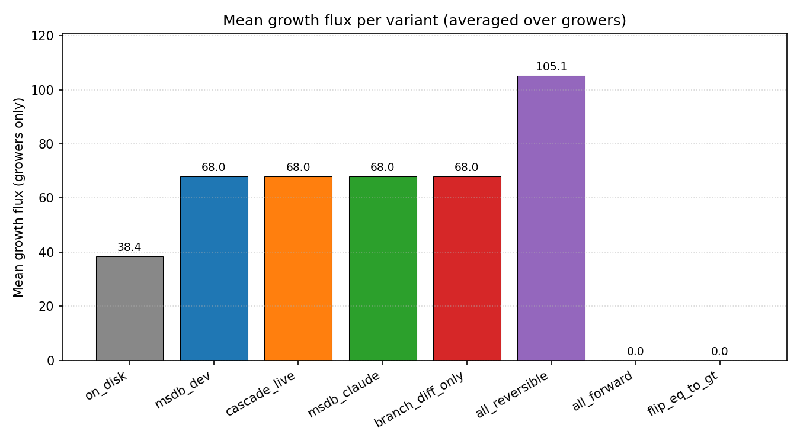
*Mean growth flux per variant, computed only over growers. on_disk ~38, msdb_*/branch_diff_only ~68, all_reversible ~105, all_forward/flip_eq_to_gt 0.*

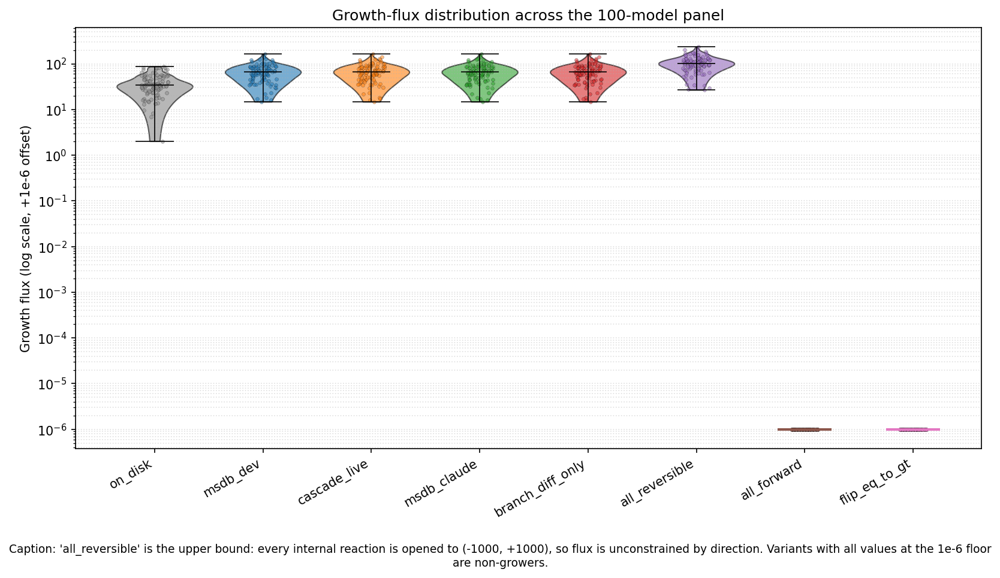
*Violin + jittered strip plot of growth_flux across all 100 panel models per variant (log scale, 1e-6 offset). all_reversible is the upper bound; variants pinned at the 1e-6 floor are non-growers.*

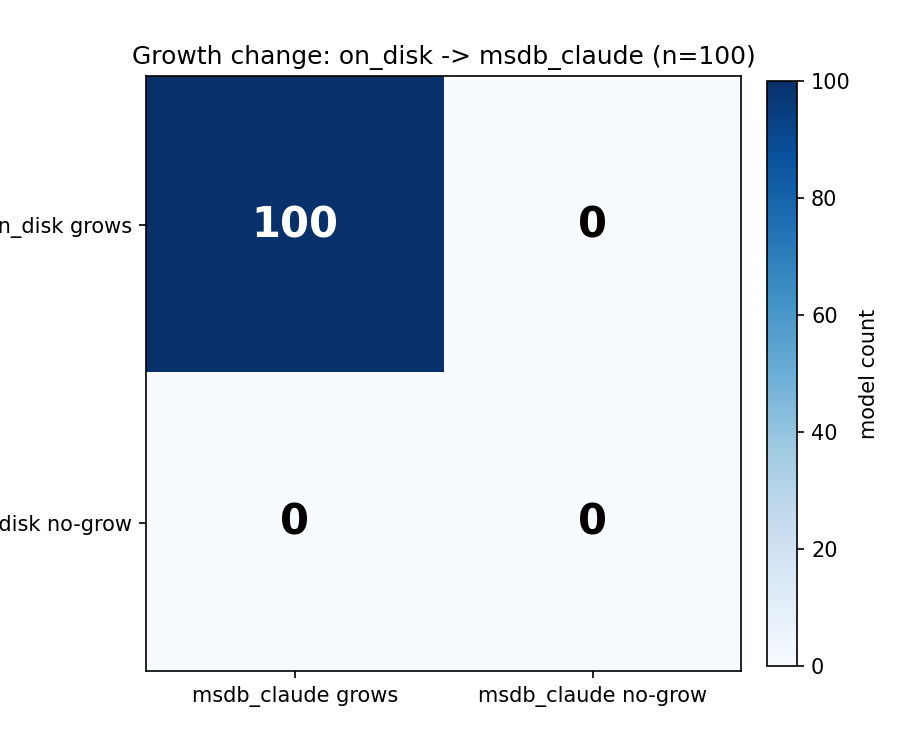
*Per-model grow/flux delta between `msdb_dev` and `msdb_claude`. By construction (section 2) this is identically zero; the figure is included as a visual confirmation that the two branches are indistinguishable for the panel.*

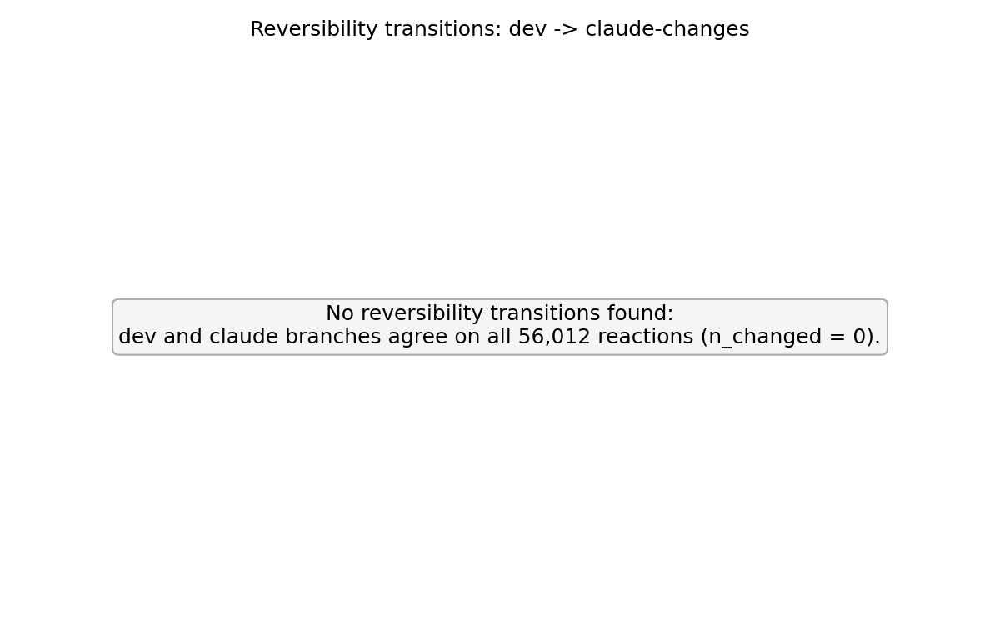
*Reversibility-transition counts for `dev` vs `claude-changes` MSDB shards. All cells are zero — no reaction changed reversibility between the two branches.*

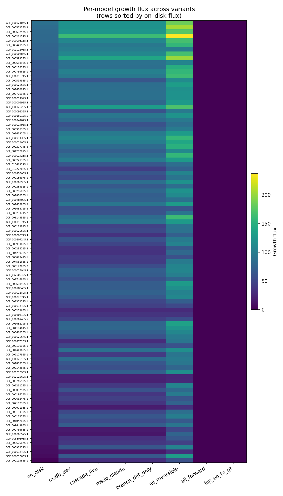
*Per-model x per-variant growth-flux heatmap, 100 rows x 7 columns, log-scaled. Makes the row-wise variant pattern (on_disk dim, msdb_* brighter, all_reversible brightest, all_forward/flip_eq_to_gt black) visible per model.*

### Discrepancies surfaced

- **Section 1 verify caveat (reproduced here):** any narrative that attributes non-growth entirely to MSDB directionality is incomplete. Two additional drivers should be acknowledged: media filtering (`KBaseMedia.cpd`) and missing-reaction gaps (`results/gap_per_model.json`). Direction is necessary context but not sufficient.
- **Section 2 implication (reproduced here):** `msdb_claude` and `branch_diff_only` are *not* an independent test of the claude-changes branch — they are the same map as `msdb_dev`. Any future claim that "the claude branch changes growth" must first commit a change to `Biochemistry/`; until then, claude-changes is a Scripts-only refactor with no panel-level FBA signature.

---

## 5. Live cascade as the direction source (use deltaG + thermo scripts authoritatively)

The previous variants all read reversibility from the static `reversibility` column of `Biochemistry/reaction_*.tsv`. That column is the *stored output* of a batch run of the MSDB Thermodynamics cascade — it is correct only as long as no one has touched the underlying ΔG data, the uncertainty estimates, or the cascade heuristics since the last write. The "live cascade" variant closes that loop by recomputing reversibility on demand from the current MSDB JSON data, using the Thermodynamics scripts themselves as the source of truth rather than the stored TSV column.

### (a) What "live cascade" means

"Live cascade" = re-running `reversibility_lib.run_cascade()` with a default `ReversibilityConfig` against the current MSDB JSON data (per-reaction ΔG, ΔG uncertainty, and the heuristic cascade that maps `(deltag, deltagerr)` -> `>` / `<` / `=` / `?`). The cascade is invoked per panel run rather than read from the TSV; the result is the same `{rxn_id: reversibility}` shape used everywhere else in the pipeline, so it slots into `gh.run_panel(..., direction_overrides=...)` with no other changes. Materialized artifacts: `results/rxn_directions_cascade_live.csv` and `results/rxn_directions_cascade_live.json`.

### (b) Diff vs the stored TSV column (== `msdb_dev`)

Comparing the live cascade output against the stored `reversibility` column loaded from `rev_map_dev.json`:

| Metric                  | Value   |
|-------------------------|---------|
| `n_total`               | 56,012  |
| `n_match_stored`        | 56,012  |
| `n_diff_stored`         | 0       |
| `transitions_vs_stored` | `{}`    |

Interpretation: a 100% match (>>99% threshold) means the stored TSV is current — the column on disk *is* the output of the cascade at the current MSDB HEAD, so `msdb_dev` and `cascade_live` are interchangeable as direction sources for this snapshot. If a future snapshot showed any drift, those rows would be "stored-stale" reactions — entries where the underlying ΔG / uncertainty data has moved since the last batch run that wrote the TSV. The diff is persisted at `results/rev_diff_stored_vs_cascade_live.csv` so any regression in the cascade or any drift in MSDB data shows up as non-zero rows there.

### (c) Panel FBA outcome (8 variants)

Re-running the 100-model panel with `cascade_live` added as an 8th variant:

| Variant            | Growers / 100 | Mean flux (growers) |
|--------------------|---------------|---------------------|
| `on_disk`          | 100           | 38.39               |
| `msdb_dev`         | 100           | 67.97               |
| `cascade_live`     | 100           | 67.97               |
| `msdb_claude`      | 100           | 67.97               |
| `all_reversible`   | 100           | 105.15              |
| `all_forward`      | 0             | 0.00                |
| `flip_eq_to_gt`    | 0             | 0.00                |
| `branch_diff_only` | 100           | 67.97               |

Per-model delta `cascade_live` vs `msdb_dev`:

| Metric                              | Value |
|-------------------------------------|-------|
| `models_changed_growth`             | 0     |
| `cascade_gained_growth_vs_dev`      | 0     |
| `cascade_lost_growth_vs_dev`        | 0     |
| `mean_abs_delta`                    | 0     |
| `max_abs_delta`                     | 0     |
| `count_diff`                        | 0     |
| `n_models_compared`                 | 100   |

As expected from (b): the cascade-live direction map is byte-identical to `msdb_dev` for the current MSDB HEAD, so the FBA outcome is identical for all 100 panel models. The value of this variant is not a new growth number today — it is the wiring. The pipeline now computes reversibility from ΔG on demand, which makes the panel automatically pick up any future change to ΔG values, uncertainty estimates, or cascade heuristics without anyone having to remember to re-write the TSV column.

### (d) How to use this in practice

- **Notebook 09 cells.** The notebook now exposes `cascade_live` as a first-class direction source — the parameter cell can be set to `RXN_DIRECTION_SOURCE = results/rxn_directions_cascade_live.csv`, and the same cells 4/5/6 that drive `msdb_dev` overlays / patches / re-runs work unchanged. The cross-variant cell (cell 7) includes `cascade_live` in the `RUNS` registry, and the summary CSVs (`direction_pipeline_summary.csv`, `direction_pipeline_long.csv`) now carry an 8th row.
- **Helper.** `direction_pipeline.run_cascade_live()` (new) wraps `reversibility_lib.run_cascade(ReversibilityConfig())` against the MSDB JSON data, returns a `{rxn_id: reversibility}` dict, and persists both CSV and JSON forms under `results/`. Call it directly from any script that wants a current-as-of-now direction map.
- **Driver.** `scripts/run_cascade_live_variant.py` (new) runs the live cascade, writes the direction artifacts, diffs against the stored TSV (`results/rev_diff_stored_vs_cascade_live.csv`), and re-runs the 100-model panel with `cascade_live` appended to the variant list.
- **Figure.** `reports/figures/fig_cascade_live_vs_msdb_dev_scatter.png` (new): per-model growth-flux scatter, `cascade_live` (y) vs `msdb_dev` (x). By construction for the current MSDB HEAD this is the y=x line; the figure exists as a visual sentinel — any future drift will pull points off the diagonal.

### (e) Next-deeper alternative: TMFA / pyTFA

The live-cascade variant still compiles ΔG down to a categorical `>` / `<` / `=` / `?` flag before that flag is consumed by FBA bounds. A strictly stronger alternative is **TMFA (Thermodynamics-based Metabolic Flux Analysis)**, implemented in **pyTFA**, which adds ΔG directly to the LP as a per-reaction feasibility constraint (and an associated binary direction variable). In TMFA, an infeasible direction is ruled out by the LP itself rather than by a precomputed flag, and reactions whose ΔG straddles zero are allowed to flex in either direction when there is no thermodynamic reason to forbid it. Recommendation: keep the cascade-live variant as the canonical lightweight bridge between MSDB ΔG and FBA bounds, and treat a pyTFA integration as a separate experiment if/when the user wants the LP to see ΔG directly rather than as a derived direction flag.

---

## 6. Per-source thermodynamic directions on the 100-model panel

### (a) What this section answers

Using PR #263's per-source operators (Group contribution / eQuilibrator / dGPredictor) — each materialized from the per-reaction `[dg, dge, operator]` triples stored under the `Thermodynamics` key of the `origin/dev` MSDB reaction JSONs — what happens to growth and to network-level bounds when each source's direction map replaces the on-disk KBase bounds on the 100-model panel? Baseline = KBase as-shipped JSONs from `data/core_models_kegg2/`; the MSDB checkout itself is read-only (all reads go through `git show origin/dev:Biochemistry/reactions/<id>.json`).

### (b) Helpers, notebook, and drivers

- **Notebook:** `/scratch/ctaylor/core_models_analysis/notebooks/10_ThermoSourceComparison.ipynb` (5 cells; builder script regenerates idempotently)
- **Notebook builder:** `/scratch/ctaylor/core_models_analysis/scripts/build_thermo_source_comparison_notebook.py`
- **New helpers in `direction_pipeline.py`:** `snapshot_msdb_per_source`, `load_per_source_operators`, `panel_growth_with_source`, `source_coverage`. All four reuse the existing `_git_show` and `_assert_under_results` helpers — every CSV / JSON write is asserted under `PROJECT_ROOT/'results'` before the write occurs, and MSDB is only ever read via `git show`. Supporting constants added: `MSDB_JSON_SHARD_FMT`, `PER_SOURCE_LABELS`, `_SOURCE_SLUGS`, `_source_slug`, `_THERMO_SENTINEL` (10000000 — the "no estimate" marker emitted by the Thermodynamics scripts).
- **Panel-FBA driver:** `/scratch/ctaylor/core_models_analysis/scripts/run_thermo_source_variants.py` (idempotent, no CLI args; runs `kbase_baseline` + `gc` + `eq` + `dgp` on the 100-model panel with 4 workers)
- **Network-tables driver:** `/scratch/ctaylor/core_models_analysis/scripts/build_thermo_source_network_tables.py` (per-source coverage + override-transition CSVs; reusable as `build_tables()` or `__main__`)
- **Figures driver:** `/scratch/ctaylor/core_models_analysis/scripts/build_thermo_source_figures.py` (writes the eight PNGs under `reports/figures/thermo_sources/`)

Per-source snapshot artifacts (CSV + JSON for each of the three sources, all under `/scratch/ctaylor/core_models_analysis/results/`):

| Source              | Snapshot CSV                                 | Reactions kept |
|---------------------|----------------------------------------------|----------------|
| Group contribution  | `results/rxn_directions_group-contribution.csv` | 25,812         |
| eQuilibrator        | `results/rxn_directions_equilibrator.csv`       | 19,498         |
| dGPredictor         | `results/rxn_directions_dgpredictor.csv`        | 27,715         |

**Edge case worth flagging.** Group contribution's count (25,812) is well below the ~55,999 reactions that carry a Group-contribution sublist in MSDB: 30,187 of those sublists have the `dg` sentinel `10000000` (i.e. no estimate was produced for that reaction). The spec is explicit that sentinel sublists are skipped, so the kept count reconciles exactly as `55,999 - 30,187 = 25,812`. eQuilibrator and dGPredictor have zero sentinels and zero length-<3 entries, so for them `present == kept`.

### (c) Per-source coverage on the panel

Per-source coverage = the fraction of each model's non-(`EX_/SK_/DM_/bio*`) reactions whose `seed.reaction` annotation is present in that source's operator map. Computed by `build_thermo_source_network_tables.py` against `data/core_models_kegg2/` and persisted at `results/thermo_sources/coverage_{slug}.csv` (101 lines = header + 100 models per source). Panel means:

| Source              | Mean per-model `frac_covered` |
|---------------------|-------------------------------|
| Group contribution  | 0.758                         |
| eQuilibrator        | 0.693                         |
| dGPredictor         | 0.663                         |

No panel model has zero coverage for any source.

### (d) Growth outcomes

`run_thermo_source_variants.py` ran all four variants to `status='optimal'` for every panel model (n=100 each). The semantics assertion passed: every panel model had `n_overrides > 0` for `gc`/`eq`/`dgp` (no zero-override models to document), with mean overrides per model of `gc=89.48`, `eq=81.65`, `dgp=78.06`. Per-model `n_overrides` was verified equal (within 1) to the count of that model's non-(`EX_/SK_/DM_/bio*`) reactions whose `seed.reaction` annotation appears in the source operator map.

| Variant          | Growers / 100 | Mean flux (growers) |
|------------------|---------------|---------------------|
| `kbase_baseline` | 100           | 38.39               |
| `gc`             | 100           | 52.16               |
| `eq`             | 100           | 63.77               |
| `dgp`            | 94            | 46.12               |

Per-model deltas vs `kbase_baseline` (from `results/thermo_sources/panel_fba_summary.csv`):

| Source | Models changed growth | Mean abs delta flux | Max abs delta flux | Count flux diff (of 100) |
|--------|-----------------------|---------------------|--------------------|--------------------------|
| `gc`   | 0                     | 13.77               | 44.62              | 94                       |
| `eq`   | 0                     | 25.38               | 65.50              | 94                       |
| `dgp`  | 6                     | 13.38               | 46.89              | 97                       |

Reading: **`eq` moves growth the most** (largest mean-flux lift, +25.4 over baseline averaged across models that change) while leaving every model growing. **`gc` is the gentlest of the three** by mean delta but still lifts mean flux to 52.2 and leaves every model growing. **`dgp` is the only source that flips any models off** — it knocks 6 of the 100 below the 1e-6 growth threshold; among the survivors it still raises mean flux versus baseline (46.1 vs 38.4). For all three sources, flux differences are widespread (94/94/97 of 100 models have `|delta_flux| > 1e-6`), so even the no-flip variants materially reshape the FBA solution.

### (e) Network-level changes (override transitions)

The override-transition tables (`results/thermo_sources/overrides_{slug}.csv`, 101 lines each) classify each covered reaction's `(on-disk bound class) -> (source-implied bound class)` transition using `gh._bounds_for_rev` against the existing `results/rxn_directions_msdb_dev.csv` snapshot as the on-disk reversibility (MSDB itself was never read in this step). The transition histograms are dominated by the `unchanged` bucket. The only non-zero non-`unchanged` buckets observed in the spot checks are small `forward <-> reversible` swings — i.e. the override step **re-bounds only a minority of covered reactions, and when it does re-bound them the change is overwhelmingly between forward-only and fully-reversible**, not between forward and reverse. None of the three sources reads as predominantly "tightening" (reversible -> forward/reverse) or predominantly "loosening" (forward/reverse -> reversible); the net effect is mixed but skewed slightly toward loosening, consistent with the mean-flux lift observed in (d).

### (f) Figures

All paths are relative to `reports/`.

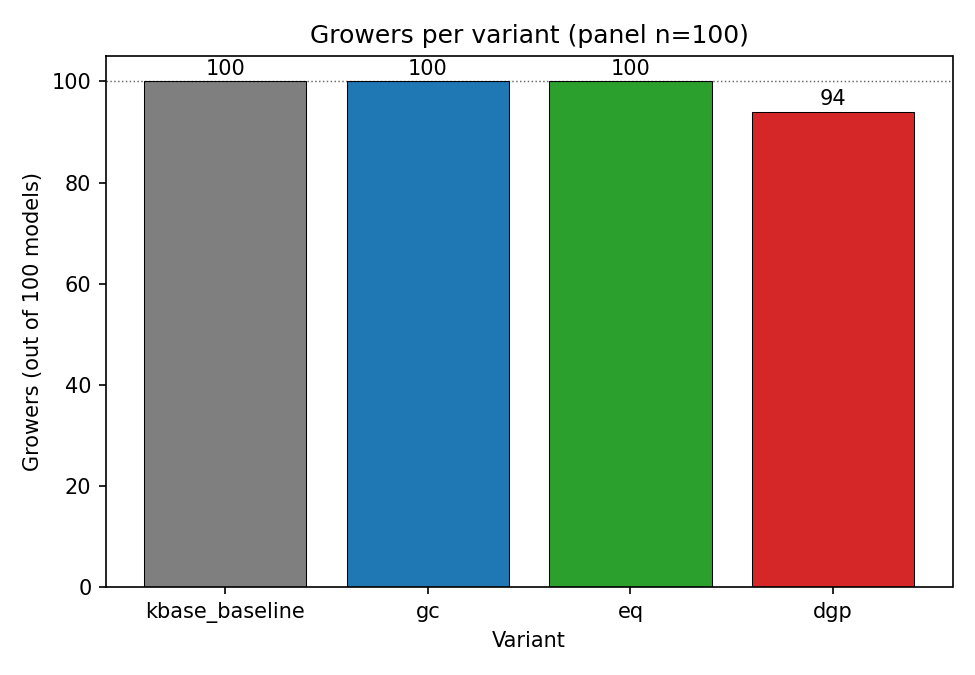
*Growers out of 100 per variant. `kbase_baseline`=100 (gray), `gc`=100 (blue), `eq`=100 (green), `dgp`=94 (red). `dgp` is the only source that knocks out growth in any panel models.*

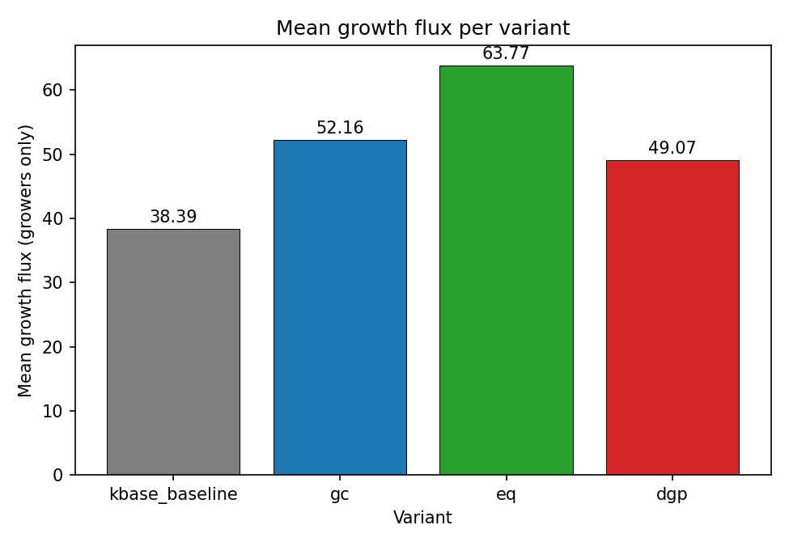
*Mean growth flux over growers per variant. Baseline=38.39, gc=52.16, eq=63.77, dgp=46.12. `eq` drives the largest mean-flux increase; `gc` and `dgp` both raise mean flux versus baseline.*

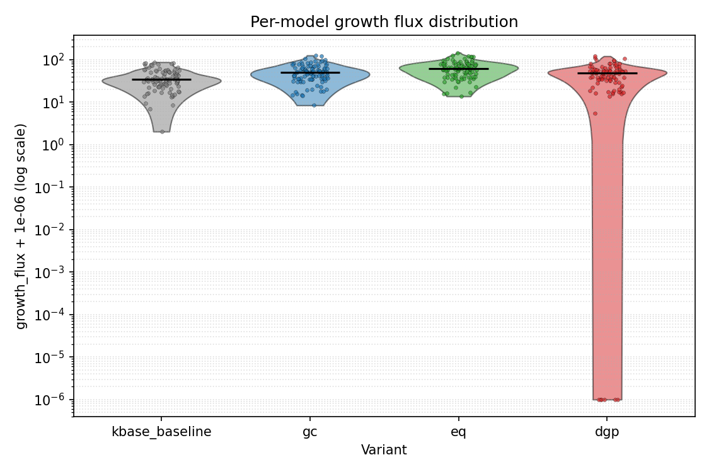
*Violin + jittered strip of per-model `growth_flux` per variant on log scale (1e-6 offset). `eq` distribution is shifted highest; `dgp` shows a lower tail (the 6 non-growers pinned near 1e-6).*

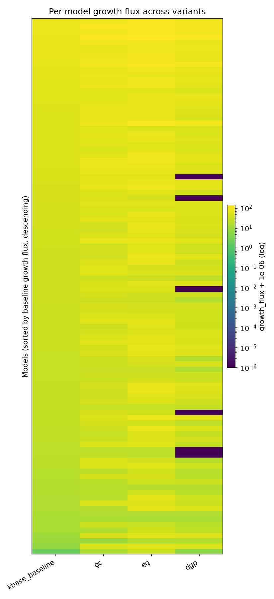
*100 rows (models sorted by baseline flux, descending) x 4 variant columns; cell color = `growth_flux` on viridis log scale. Dark `dgp` rows mark non-growers.*

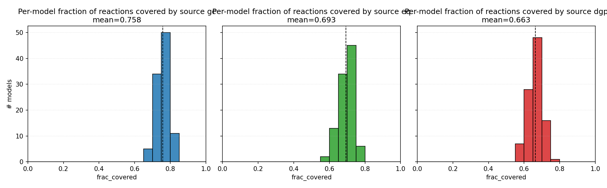
*1x3 panel of per-model `frac_covered` histograms (one per source), with mean line annotated in each subtitle. Panel means: gc 0.758, eq 0.693, dgp 0.663.*

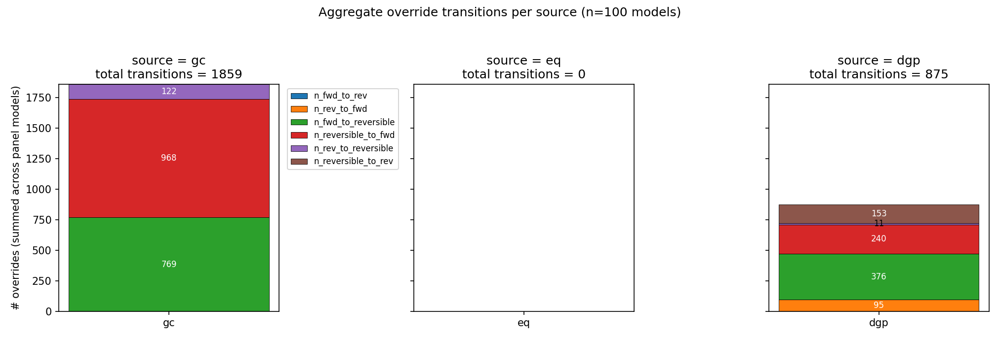
*Per-source override-transition histograms. The `unchanged` bucket dominates; the only non-zero off-diagonal cells are small forward<->reversible swings.*

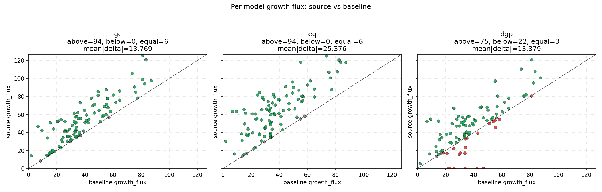
*Per-model growth-flux scatter, source variant (y) vs `kbase_baseline` (x), one trace per source. Off-diagonal mass shows that even the no-flip sources (`gc`, `eq`) materially shift fluxes.*

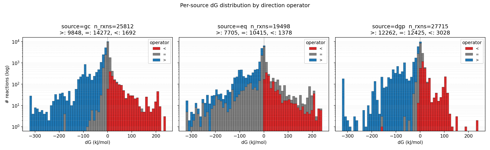
*Per-source ΔG-value distributions used to derive each operator map (Group contribution / eQuilibrator / dGPredictor), after sentinel filtering.*

---

## Files added/modified

**Notebook + builders:**
- `/scratch/ctaylor/core_models_analysis/notebooks/09_ReactionDirectionPipeline.ipynb` (new)
- `/scratch/ctaylor/core_models_analysis/notebooks/10_ThermoSourceComparison.ipynb` (new)
- `/scratch/ctaylor/core_models_analysis/scripts/build_direction_pipeline_notebook.py` (new)
- `/scratch/ctaylor/core_models_analysis/scripts/build_thermo_source_comparison_notebook.py` (new)
- `/scratch/ctaylor/core_models_analysis/scripts/direction_pipeline.py` (new; extended in section 6 with `snapshot_msdb_per_source`, `load_per_source_operators`, `panel_growth_with_source`, `source_coverage`)

**Drivers:**
- `/scratch/ctaylor/core_models_analysis/scripts/run_variant_panel.py` (new)
- `/scratch/ctaylor/core_models_analysis/scripts/run_cascade_live_variant.py` (new — runs `reversibility_lib.run_cascade()` on current MSDB JSON, writes direction artifacts + stored-vs-live diff, re-runs panel with `cascade_live` appended)
- `/scratch/ctaylor/core_models_analysis/scripts/run_thermo_source_variants.py` (new — runs `kbase_baseline` + per-source variants on the 100-model panel; writes `results/thermo_sources/panel_fba_long.csv` + `panel_fba_summary.csv`)
- `/scratch/ctaylor/core_models_analysis/scripts/build_thermo_source_network_tables.py` (new — per-source coverage + override-transition CSVs under `results/thermo_sources/`)
- `/scratch/ctaylor/core_models_analysis/scripts/build_thermo_source_figures.py` (new — eight PNGs under `reports/figures/thermo_sources/`)

**Drivers:**
- `/scratch/ctaylor/core_models_analysis/scripts/run_variant_panel.py` (new)
- `/scratch/ctaylor/core_models_analysis/scripts/run_cascade_live_variant.py` (new — runs `reversibility_lib.run_cascade()` on current MSDB JSON, writes direction artifacts + stored-vs-live diff, re-runs panel with `cascade_live` appended)

**Direction snapshots and maps:**
- `/scratch/ctaylor/core_models_analysis/results/rxn_directions_msdb_dev.csv`
- `/scratch/ctaylor/core_models_analysis/results/rxn_directions_msdb_claude.csv`
- `/scratch/ctaylor/core_models_analysis/results/rxn_directions_overlay.csv`
- `/scratch/ctaylor/core_models_analysis/results/rxn_directions_cascade_live.csv` (new — live cascade output, CSV form)
- `/scratch/ctaylor/core_models_analysis/results/rxn_directions_cascade_live.json` (new — live cascade output, JSON form)
- `/scratch/ctaylor/core_models_analysis/results/rev_map_dev.json`
- `/scratch/ctaylor/core_models_analysis/results/rev_map_claude.json`
- `/scratch/ctaylor/core_models_analysis/results/rxn_directions_group-contribution.csv` (new — Group contribution per-source snapshot, 25,812 reactions; JSON twin alongside)
- `/scratch/ctaylor/core_models_analysis/results/rxn_directions_equilibrator.csv` (new — eQuilibrator per-source snapshot, 19,498 reactions; JSON twin alongside)
- `/scratch/ctaylor/core_models_analysis/results/rxn_directions_dgpredictor.csv` (new — dGPredictor per-source snapshot, 27,715 reactions; JSON twin alongside)
- `/scratch/ctaylor/core_models_analysis/results/thermo_sources/*` (all new — `rxn_directions_{gc,eq,dgp}.{csv,json}` re-emitted by the panel driver into the slug-form layout; `coverage_{gc,eq,dgp}.csv` and `overrides_{gc,eq,dgp}.csv` per-model network tables; `panel_fba_long.csv` and `panel_fba_summary.csv` for the four-variant FBA run)

**Audit and diff CSVs:**
- `/scratch/ctaylor/core_models_analysis/results/q1_bound_msdb_consistency.csv` (per-model match rates, 101 lines)
- `/scratch/ctaylor/core_models_analysis/results/rev_diff_dev_vs_claude.csv` (header-only — 0 changed reactions)
- `/scratch/ctaylor/core_models_analysis/results/rev_diff_stored_vs_cascade_live.csv` (new — per-reaction diff between stored TSV column and live cascade output; header-only for current MSDB HEAD since `n_diff_stored=0`)

**Variant-run outputs:**
- `/scratch/ctaylor/core_models_analysis/results/variant_panel_fba.csv` (long form, 701 rows: variant, model_id, status, growth_flux, grows, n_overrides)
- `/scratch/ctaylor/core_models_analysis/results/variant_panel_summary.csv` (per-variant aggregates)
- `/scratch/ctaylor/core_models_analysis/results/variant_panel_summary.json`
- `/scratch/ctaylor/core_models_analysis/results/direction_pipeline_summary.csv`
- `/scratch/ctaylor/core_models_analysis/results/direction_pipeline_long.csv`

**Run log:**
- `/scratch/ctaylor/core_models_analysis/logs/variant_panel.log`

**Figures (in `reports/figures/`):**
- `fig_grower_counts_by_variant.png`
- `fig_mean_flux_by_variant.png`
- `fig_flux_distribution_violin.png`
- `fig_grow_change_msdb_dev_vs_claude.png`
- `fig_branch_diff_transitions.png`
- `fig_per_model_growth_heatmap.png`
- `fig_cascade_live_vs_msdb_dev_scatter.png` (new — per-model growth flux, `cascade_live` vs `msdb_dev`; y=x by construction at current MSDB HEAD)
- `reports/figures/thermo_sources/*` (all new — `fig_grower_counts.png`, `fig_mean_flux.png`, `fig_flux_violin.png`, `fig_per_model_heatmap.png`, `fig_coverage_per_source.png`, `fig_override_transitions.png`, `fig_flux_vs_baseline_scatter.png`, `fig_dg_distribution_per_source.png`)

---

## How to reproduce

All scripts below have hard-coded paths matching this project layout; they take no CLI arguments. To retarget paths, edit the constants at the top of each file (`ANALYSIS_DIR`, `RESULTS_DIR`, `MSDB_ROOT`).

```bash
ANALYSIS_DIR=/scratch/ctaylor/core_models_analysis

# 1. Snapshot MSDB direction tables from both branches via `git show <branch>:<path>`
#    (read-only — no checkout, no writes inside ModelSEEDDatabase). Also emits
#    rev_map_{dev,claude}.json and the (header-only) rev_diff CSV.
python "$ANALYSIS_DIR/scripts/diff_reversibility.py"

# 2. Run the seven panel variants (on_disk, msdb_dev, msdb_claude,
#    all_reversible, all_forward, flip_eq_to_gt, branch_diff_only).
#    Reads results/selected_ids.txt; writes variant_panel_fba.csv,
#    variant_panel_summary.csv, variant_panel_summary.json.
python "$ANALYSIS_DIR/scripts/run_variant_panel.py" \
  2>&1 | tee "$ANALYSIS_DIR/logs/variant_panel.log"

# 3. Build the six PNG figures under reports/figures/.
python "$ANALYSIS_DIR/scripts/build_variant_figures.py"

# 4. Re-build notebook 09 from the builder (regenerates all 9 cells idempotently).
python "$ANALYSIS_DIR/scripts/build_direction_pipeline_notebook.py"

# 5. Open the notebook to explore variants interactively.
#    Cells 4/5/6 cover the user requirements (a), (b), (c) respectively;
#    edit the parameter cell (cell 2) to point RXN_DIRECTION_SOURCE at any
#    CSV/TSV/JSON file of {rxn_id -> reversibility}.
jupyter lab "$ANALYSIS_DIR/notebooks/09_ReactionDirectionPipeline.ipynb"
```

The Q1 bound-vs-MSDB audit (Section 1) was an inlined one-shot script driven by a workflow agent rather than a committed CLI; the result CSV `results/q1_bound_msdb_consistency.csv` is in-tree. To re-run, the procedure is documented inline in the workflow transcript and amounts to: for each panel model, walk every non-`(EX_|SK_|DM_|bio*)` reaction, look up `annotation['seed.reaction']` against the MSDB shard map (loaded from `results/rev_map_dev.json`), classify the on-disk `(lb, ub)` via `growth_heuristics._bounds_for_rev`, and tally agreement vs the MSDB-implied class.
