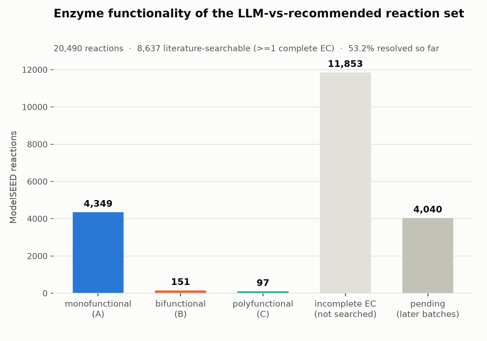
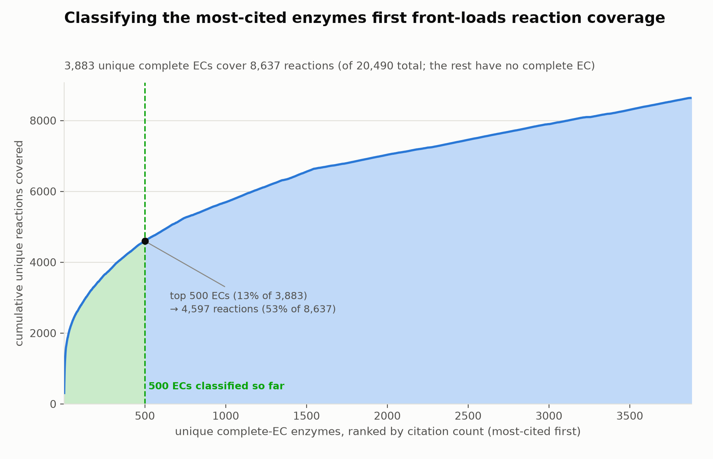

# Enzyme functionality (mono/bi/polyfunctional) behind the LLM-vs-recommended reaction set

Built 2026-10-07 against ModelSEED `dev` @ `078a395f`
(`/scratch/ctaylor/tmp/devsnap_078a395f`) — the same snapshot used by
[`reports/llmVsRecommended/LLM_VS_RECOMMENDED_DIRECTION.md`](../llmVsRecommended/LLM_VS_RECOMMENDED_DIRECTION.md).

**Status: batch 1 of ~8 complete — 500 of 3,883 enzymes classified.** See
[Batch 1 results](#batch-1-results-500500-ecs) for what came back, and
[Cost estimate and next step](#cost-estimate-and-next-step) for batch 2's
estimate (already computed, awaiting go-ahead).

## Background

That report defines a set of **20,490 "comparable" reactions**: every
non-obsolete ModelSEED reaction where both the recommended reversibility and
the LLM ensemble's direction call are present and directional. This report
classifies the *enzymes* behind those reactions — via PubMed/EuropePMC
literature search — as:

- **(A) monofunctional** — one catalytic activity.
- **(B) bifunctional** — a single polypeptide/complex carrying two distinct,
  fused catalytic activities (classically each with its own EC number — the
  textbook case is PFK-2/FBPase-2, or methylenetetrahydrofolate
  dehydrogenase/cyclohydrolase).
- **(C) polyfunctional** — three or more fused catalytic activities (e.g. CAD:
  carbamoyl-phosphate synthetase / aspartate transcarbamylase /
  dihydroorotase; "trifunctional enzyme").
- **a 4th category, `incomplete_ec`** — the reaction has no complete EC
  number to classify (`x.x.x.-`, or no `ec_numbers` at all). Assigned
  directly, no literature search.

**Important scoping note on B/C**: literature often describes a protein as
having a "dual function" or "moonlighting" role that is *not* a second
catalytic activity — e.g. a probe search for `"EC 2.7.1.1" AND (bifunctional
OR multifunctional)` surfaces papers describing hexokinase's secondary role
in sugar *signaling*, which is regulatory, not a second EC-type catalytic
activity. Hexokinase stays **monofunctional**. Only a second (or third)
genuine catalytic activity counts toward B/C.

## Methodology

### Reaction universe and EC completeness

Reusing the exact comparable-reaction filter from
`scripts/build_llm_vs_recommended_mismatches.py` (non-obsolete, recommended
reversibility and LLM direction both directional), of the 20,490 reactions:

| | reactions |
|---|---:|
| total comparable reactions | 20,490 |
| no `ec_numbers` field at all | 9,866 |
| `ec_numbers` present but every entry incomplete (`x.x.x.-`) | 1,987 |
| **→ `incomplete_ec` (4th category, no search needed)** | **11,853** |
| **≥1 complete EC number (`\d+\.\d+\.\d+\.\d+`) — needs a search** | **8,637** |

Of those 8,637, **1,114 reactions carry more than one EC number**. A reaction
whose multiple ECs land in different categories once classified takes the
**max-multiplicity label** (polyfunctional > bifunctional > monofunctional)
and is also listed under `mixed_ec_reactions` in the output JSON so these
cases stay auditable.

### Unit of work: the enzyme, not the reaction

Classification happens at the **EC number** level, since the same enzyme
backs many reactions. The 8,637 EC-bearing reactions cite only **3,883
unique complete EC numbers** — that's the real queue size, and what "500 at a
time" chunks over.



*(Figure source: `scripts/plot_enzyme_functionality_category_counts.py`,
registered in `scripts/figures.tsv` as
`enzyme_functionality_category_counts`. Regenerate with
`python3 scripts/regen_figures.py enzyme_functionality_category_counts` after
every batch. Numbers also in
`results/enzyme_functionality/category_counts.tsv`, including a `pending` row
so the figure's denominator is always the true 20,490, not just what's
classified so far.)*

### "Sorted by how common" — frequency-first batching

ECs are processed most-cited-first (by count of comparable reactions citing
them in ModelSEED — e.g. `1.2.1.5`, an aldehyde dehydrogenase, is the single
most-cited EC at 307 reactions). This front-loads coverage: the top 500 of
3,883 ECs (13%) already cover 4,597 of the 8,637 EC-bearing reactions (53%).



*(Figure source: `scripts/plot_enzyme_functionality_ec_coverage.py`,
registered in `scripts/figures.tsv` as `enzyme_functionality_ec_coverage`.
This is the full theoretical curve over all 3,883 ECs — it exists
independent of how many have actually been classified; the green-shaded
prefix is batch 1's 500 ECs. Regenerate with `python3 scripts/regen_figures.py
enzyme_functionality_ec_coverage`. Numbers also in
`results/enzyme_functionality/ec_frequency_coverage.tsv`.)*

## Batch 1 results (500/500 ECs)

All 500 ECs in batch 1 (the 500 most-cited complete EC numbers in the
comparable set) are classified. 20 `general-purpose` Sonnet 5 subagents ran
in parallel, one per ~25-EC chunk:

| category | ECs | reactions (provisional\*) |
|---|---:|---:|
| monofunctional (A) | 471 | 4,349 |
| bifunctional (B) | 21 | 151 |
| polyfunctional (C) | 8 | 97 |

\*"Reactions" here counts only reactions whose EC set is now fully resolved,
or provisionally bucketed by the categories known so far if some of their
other ECs are still pending — see `mixed_ec_reactions` in
`reaction_classification.json` (302 reactions currently flagged this way;
their label may still change as more ECs are classified). 4,040 reactions
remain entirely unclassified (all their ECs are still in the queue).

A sample of the more interesting literature-backed calls (full rationale +
PMIDs for every EC are in `results/enzyme_functionality/classifications.json`):

- **Polyfunctional**: EC 2.7.7.7 (DNA polymerase I — polymerase + 3′→5′
  proofreading exonuclease + 5′→3′ exonuclease, one polypeptide, PMID
  1548239); EC 3.1.1.5 / E. coli TesA (thioesterase + protease +
  lysophospholipase, PMID 12842470 and others); EC 1.1.1.35 + EC 4.2.1.17,
  both resolved to the peroxisomal "trifunctional enzyme" EHHADH (UniProt
  Q08426).
- **Bifunctional**: EC 1.5.1.3 (dihydrofolate reductase, fused with
  thymidylate synthase as DHFR-TS in protozoan parasites and plants, PMID
  37107025); EC 4.1.2.30 (the 17,20-lyase activity of CYP17A1, fused with
  17α-hydroxylase — "combined 17α-hydroxylase/17,20-lyase deficiency" is a
  standard clinical term); EC 3.2.1.108 (lactase, fused with phlorizin
  hydrolase into mammalian LPH).
- **Correctly excluded as moonlighting, not bifunctional**: EC 2.7.1.1
  (hexokinase — sugar-signaling role is regulatory, confirmed per the
  worked example); EC 4.2.1.3 (aconitase/IRP1 RNA-binding); EC 5.3.1.9
  (glucose-6-phosphate isomerase/neuroleukin signaling); EC 3.1.3.4
  (phosphatidate phosphatase/lipin's nuclear co-regulator role).
- **Correctly excluded as multi-subunit complexes (not a fused
  polypeptide)**: EC 1.2.4.2 (2-oxoglutarate dehydrogenase E1, part of the
  separate-polypeptide E1/E2/E3 complex) and EC 1.14.12.18 (biphenyl
  dioxygenase's oxygenase/ferredoxin/reductase components).

### Cost calibration from batch 1 (important for future estimates)

The pre-batch estimate for 500 ECs was $4.01–$7.23. Actual usage, summed
across all 20 subagents: **2,740,408 total tokens, 692 tool calls** (692/500
= 1.38 tool calls per EC — almost exactly the assumed ~1–2 PubMed searches
per enzyme). But **total tokens ran ~2.6x the pre-batch estimate**
(~5,481 tokens/EC actual vs. ~2,115/EC assumed), most likely because a
`general-purpose` subagent's full tool catalog — not just the 2–3 PubMed
tools actually used — is loaded every turn, and a ~25-enzyme, 30+-turn
conversation resends its growing transcript each turn. **The cost model in
`enzyme_functionality_batch.py` has been recalibrated by this ~2.6x factor**
for later batches; `batch_01_manifest.json` already reflects it (see below).

### Batching, checkpointing, and resuming

Three scripts, outputs under `results/enzyme_functionality/`:

1. **`scripts/build_enzyme_functionality_queue.py`** — one-time, idempotent.
   Builds `reaction_ec_map.json` (every reaction's EC status) and
   `ec_frequency.json` (the 3,883 unique ECs, sorted descending by citation
   count — the work queue). Initializes `progress.json` and an empty
   `classifications.json` only if they don't already exist, so re-running it
   never erases batch progress.
2. **`scripts/enzyme_functionality_batch.py plan`** — reads `progress.json` +
   `ec_frequency.json` + `classifications.json`, takes the next up-to-500
   *unclassified* ECs in frequency order, splits them into ~25-EC chunks for
   parallel literature-search subagents, writes a `batch_NN_manifest.json`,
   and **prints a cost estimate for that exact manifest** — no model or MCP
   call happens in this step.
3. **`scripts/enzyme_functionality_batch.py ingest <files...> --batch NN`** —
   after the subagents return their per-EC classifications, merges them into
   `classifications.json` (validates category and EC format; refuses to
   silently overwrite an existing entry without `--force`) and marks the
   batch done in `progress.json`.
4. **`scripts/build_enzyme_functionality_outputs.py`** — re-run after every
   ingest. Derives the final deliverable, `reaction_classification.json`
   (`{"monofunctional": [rxn ids...], "bifunctional": [...],
   "polyfunctional": [...], "incomplete_ec": [...]}`), plus the TSVs the two
   figures above read.

This makes the whole pipeline resumable: classifying another 500 enzymes
later is `enzyme_functionality_batch.py plan` → review the printed cost →
run the subagents → `ingest` → `build_enzyme_functionality_outputs.py`.

### How each batch of 500 is actually searched

Each ~25-EC chunk is handed to a `general-purpose` subagent (Claude Sonnet 5)
with: the EC number, its citation count, one example reaction name as a
search hint, the A/B/C definitions above (including the moonlighting
exclusion and worked examples), and instructions to use
`pubmed_europepmc_search` (primary — broader corpus, covers preprints) and
`pubmed_search_articles` (fallback) per EC. Each subagent returns one JSON
object per EC: `{category, confidence, rationale (≤2 sentences), evidence:
PMIDs, or "none found, defaulted to monofunctional"}`. This is a
literature-search signal, not a lookup against a curated enzyme-function
database (BRENDA/UniProt are not available as MCP tools here) — treat
low-confidence / no-evidence calls accordingly.

## Cost estimate and next step

Pricing: Claude Sonnet 5, $2/MTok input, $10/MTok output (user's choice over
Haiku 4.5, to get the bifunctional-vs-moonlighting judgment right).

Post-batch-1 assumptions (recalibrated from actual usage, ~2.6x the original
pre-batch numbers — see [Cost calibration from batch 1](#cost-calibration-from-batch-1-important-for-future-estimates)):
~3,900 input + ~1,235 output tokens per enzyme, ~9,100 fixed input tokens of
tool-schema/instruction overhead per 25-EC chunk.

**Batch 2 (`batch_01_manifest.json`, already generated, 500 ECs / 20
chunks):**

| | |
|---|---:|
| estimated input tokens | ~2,132,000 |
| estimated output tokens | ~617,500 |
| **estimated cost** | **$10.44 – $18.79** |

**Remaining project** (2,883 unique ECs left after batch 1, ~6 more batches):
roughly **$125–225** at the recalibrated rate — notably higher than the
original rough full-project guess of $30–55, now that batch 1 gives a real
data point instead of an assumption. `enzyme_functionality_batch.py plan`
quotes the real EC/chunk count for every batch rather than reusing this
number, and **no literature search runs until each batch's estimate is
reviewed**.

Batch 2's manifest is ready at
`results/enzyme_functionality/batch_01_manifest.json`. Awaiting go-ahead to
spend the ~$10–19 and run it.

## Resuming later

```bash
# 1. plan the next batch (free -- no model calls) and read the printed cost
python3 scripts/enzyme_functionality_batch.py plan

# 2. (after running the literature-search subagents and saving their JSON
#    outputs to disk) merge results in -- batch 0 is done, next is batch 1
python3 scripts/enzyme_functionality_batch.py ingest chunk_01_*.json --batch 1

# 3. regenerate the deliverable JSON + figure source data
python3 scripts/build_enzyme_functionality_outputs.py

# 4. redraw the figures
python3 scripts/regen_figures.py enzyme_functionality_category_counts enzyme_functionality_ec_coverage
```

Progress so far: **500 / 3,883** unique ECs classified (batch 1 done),
**16,450 / 20,490** reactions assigned a category (11,853 `incomplete_ec` +
4,597 from batch 1's ECs, some provisional pending the rest of their
reaction's ECs), **4,040** reactions still entirely unclassified.
