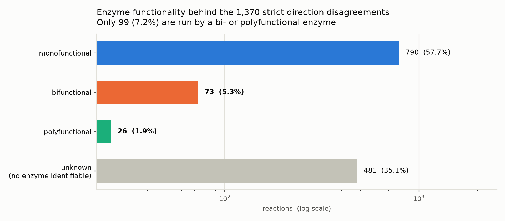
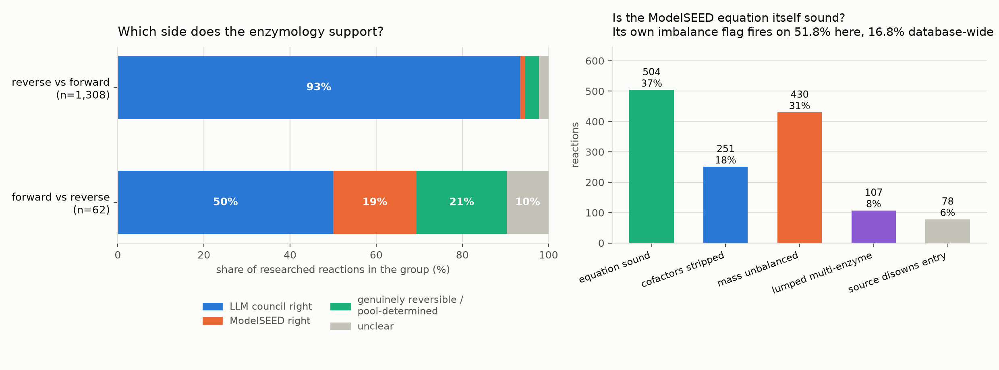

# Enzyme functionality behind the 1,370 strict direction disagreements

Built 2026-10-08 against ModelSEED `dev` @ `078a395f`
(`/scratch/ctaylor/tmp/devsnap_078a395f`), the same snapshot as
[`reports/llmVsRecommended/LLM_VS_RECOMMENDED_DIRECTION.md`](../llmVsRecommended/LLM_VS_RECOMMENDED_DIRECTION.md).

**Status: complete — 1,370 / 1,370 reactions researched, no gaps.**

## What was asked, and what came back

The LLM-vs-recommended report splits 8,466 direction mismatches into six
groups. Two of them are *strict* disagreements, where the recommendation and
the LLM council pick opposite sides rather than merely differing over whether
a reaction is bidirectional:

| group | recommended | LLM ensemble | reactions |
|---|:---:|:---:|---:|
| `forward_vs_reverse` | `>` forward | `<` reverse | 62 |
| `reverse_vs_forward` | `<` reverse | `>` forward | 1,308 |
| **total** | | | **1,370** |

The question put to the literature was: **is each of these reactions run by a
bifunctional or polyfunctional enzyme?** — the hypothesis being that an enzyme
with two fused catalytic activities might run chemistry in both senses and so
explain why two direction calls disagree.

**The answer is no, and the margin is not close.**

| | reactions | share |
|---|---:|---:|
| monofunctional | 790 | 57.7% |
| **bifunctional** | **73** | **5.3%** |
| **polyfunctional** | **26** | **1.9%** |
| unknown (no enzyme identifiable) | 481 | 35.1% |
| **bi- or polyfunctional, combined** | **99** | **7.2%** |



Only 50 of the 99 multifunctional calls are high-confidence, and only 35 carry
a note saying the multifunctionality bears on the *direction* at all. So the
honest headline is that **multifunctional enzymes explain a few dozen of 1,370
disagreements, not the phenomenon.**

The recurring genuine cases are worth having: lactase-phlorizin hydrolase (6
reactions, two distinct glycosidase sites on one chain), DNA polymerase I (4,
polymerase + two exonucleases), aphidicolan-16β-ol synthase (3, fused class
II/class I diterpene cyclase), class A PBPs (3, transglycosylase +
transpeptidase). The single cleanest case where bifunctionality really does
drive the conflict is **`rxn55967`**, a 1-testosterone hydratase/dehydrogenase
whose dehydrogenase half pulls the hydration forward, and **`rxn50031`**
(PaaZ), whose fused ALDH domain irreversibly consumes the hydratase domain's
product.

## What actually explains the disagreements

Having searched all 1,370 reaction-by-reaction, the dominant finding is a
different one, and it replicated in every chunk independently.

### 1. The enzymology almost always sides with the LLM council — but only in one group

| group | n | LLM right | ModelSEED right | genuinely reversible | unclear |
|---|---:|---:|---:|---:|---:|
| `forward_vs_reverse` | 62 | 31 (50%) | **12 (19%)** | 13 (21%) | 6 (10%) |
| `reverse_vs_forward` | 1,308 | **1,221 (93%)** | 17 (1%) | 41 (3%) | 29 (2%) |

**These are two different phenomena and must not be pooled.** The small group
is a genuine mixed bag where ModelSEED is often right (Renilla luciferin
sulfotransferase really does desulfate; succinate:quinone oxidoreductase
really is named misleadingly). The large group is a near-systematic failure.

### 2. More than half of these equations are broken, and ModelSEED already knows

`equation_defect`, assigned per reaction from the literature:

| | reactions |
|---|---:|
| equation sound | 504 (36.8%) |
| mass unbalanced | 430 |
| cofactors stripped | 251 |
| lumped multi-enzyme | 107 |
| source disowns the entry | 78 |
| **carrying some defect** | **866 (63.2%)** |

This is corroborated by a check that needs no literature and no model
judgment — ModelSEED's own `status` field:

| set | flagged mass/charge imbalanced |
|---|---:|
| all non-obsolete reactions (baseline) | 8,125 / 48,384 = **16.8%** |
| all 8,466 recommended-vs-LLM mismatches | 1,128 = **13.3%** |
| **the 1,370 strict disagreements** | **710 = 51.8%** |

**3.1× the database baseline.** Note that general disagreement is *not*
enriched (13.3%, below baseline) — broken stoichiometry travels specifically
with strict, opposite-direction conflicts.



### 3. ModelSEED's recommendation contradicts its own primary source

The snapshot ships a MetaCyc dump under `Provenance/MetaCyc/`, whose equations
carry the arrow MetaCyc itself asserts. For the 709 strict reactions that
resolve there:

| | count | share |
|---|---:|---:|
| MetaCyc writes `=>` (irreversible forward), ModelSEED recommends `<` | **491** | **69.3%** |
| MetaCyc's direction agrees with the **LLM council** | 502 | **70.8%** |
| MetaCyc's direction agrees with the **recommendation** | 45 | **6.3%** |

This is the strongest result here because no LLM judgment enters it. Where the
source database has an opinion, the thermodynamic cascade overrides it and is
wrong roughly eleven times out of twelve.

Separately, of the 190 reactions carrying a stored `direction` field, **184
(97%) say `=` (reversible)** and were overridden to a strict direction.

### 4. A confident grade on a broken equation

| thermo grade | n | ModelSEED flags the equation imbalanced |
|---|---:|---:|
| **gold** | 49 | **36 (73%)** |
| silver | 422 | 188 (45%) |
| bronze | 899 | 486 (54%) |

Gold — the *highest*-confidence tier — has the *worst* imbalance rate. The
grade certifies the number's self-consistency, not the chemistry's validity.
`rxn14318` is the worked example: gold, self-certain, corroborated, on a
reaction KEGG itself annotates "unclear reaction" with no EC and no orthology.
This is the same conclusion `reports/thermoSourceMethod/` reached from a
different direction — *grade is a trust label, not a selector*.

### 5. Specific, mechanically fixable defect classes

- **Dropped products that already exist in the database.** 349 reactions
  (25%) have a mass residual matching an existing compound exactly — most
  often oxidised glutathione `cpd00111` (39 reactions, independently found by
  hand in five separate chunks), ADP `cpd00008` (16), CO₂ (13), PPi (9), O₂
  (9). These are import bugs with the counterpart sitting in the compound
  table, not research problems. *Caveat: formula matching cannot distinguish
  isomers, so entries like "D-Glucose" are candidates, not confirmations.*
- **Orphan ADP.** 17 reactions carry a residual of exactly one or three whole
  ADP molecules. **That is 17 of the 21 such cases in the entire database
  (81%)** — 28.6× enriched.
- **dGPredictor has the wrong sign on SAM methyl transfer.** Of 93
  SAM-containing reactions here, **92 (99%) get a positive ΔG**, median
  **+32.8 kJ/mol**, for chemistry that is ~−60 kJ/mol. The values repeat
  verbatim (29.04 ×11, 32.81 ×10, 32.25 ×10), so a handful of mis-signed
  class-level group estimates are flipping dozens of reactions each.
- **Free FAD/FADH₂ standing in for ETF/quinone coupling.** The single most
  reported `cofactors_stripped` pattern, hitting acyl-CoA
  dehydrogenases/oxidases across at least a dozen chunks. Removing the
  electron sink is exactly what removes the irreversibility.
- **Combinatorial expansions.** 126 reactions (9.2%) are generic-reaction
  expansions (`.metaexp.`, `.chlamyexp.`, `.maizeexp.`) that pair
  non-corresponding substrate and product instances — e.g. a tricyclic C20
  diterpene aldehyde "oxidised" to a straight-chain C20 fatty acid. Only
  **1.4× enriched**, so expansions are not themselves a cause of strict
  disagreement; they are simply reliably broken when they do appear.

## Zooming into the 504 reactions with a sound equation

Section 2 split the 1,370 into 504 (36.8%) with no `equation_defect` and 866
(63.2%) carrying one. The 504 are the cleanest possible test of the
recommendation cascade: there is no bad stoichiometry to blame, so whatever's
wrong is the direction call itself, not the data it was computed from.

### The shape of the 504

| | forward_vs_reverse (35) | reverse_vs_forward (469) |
|---|---:|---:|
| literature says the **LLM** is right | 23 (66%) | 442 (94%) |
| literature says **ModelSEED** is right | 9 (26%) | 10 (2%) |
| genuinely reversible / no side favoured | 0 | 14 (3%) |
| unclear — no enzyme identifiable either way | 3 (9%) | 3 (1%) |

Pooled: **465/504 (92.3%)** side with the LLM, **19 (3.8%)** with ModelSEED,
**14 (2.8%)** are genuinely reversible, **6 (1.2%)** unclear. The two groups
still should not be pooled for interpretation (56% of `forward_vs_reverse` is
defect-free vs. 36% of `reverse_vs_forward`, and the small group is a real
mixed bag), but once an equation is confirmed sound, *both* groups lean
toward "LLM right" — it's a matter of degree (66% vs. 94%), not direction.

Why, mechanically, if not a broken equation: the recommendation is built on
weak evidence stated with unwarranted confidence. **84.5%** of the 504 carry
a thermo self-assessment of `unconfident` and **68.1%** are `bronze` grade
(lowest trust tier) — yet all were still promoted to a *strict* directional
call instead of `=`. Only 3 of 504 (0.6%) are `gold` grade, and even those
are wrong (MTAP, ADC synthase, and PhzE/ADIC synthase — see below). By
source: **dGPredictor drove 59.3%** of the 504, **eQuilibrator 40.1%**, and
**Group Contribution essentially none** — the same two ML/computed sources
implicated throughout this report, never the simpler legacy method.

### The 19 where the literature actually backs ModelSEED

Not every "strict disagreement" is a cascade failure. Four of the 19 are the
**same enzyme family**: succinate:quinone oxidoreductase / respiratory
complex II (`rxn09272`, `rxn37562`, `rxn37563`, `rxn58717`). Each entry is
*named* "fumarate reductase" while the *equation* is written as succinate
oxidation against a high-potential ubiquinone acceptor — the redox chemistry
favours the written (forward) direction, and the council most plausibly
read the name rather than the equation. Two more
(`rxn07646`, `rxn11574`, lycopene β-cyclase) also appear in the bifunctional
list above: the fused phytoene-synthase/cyclase domain is *why* the
committed, ModelSEED-matching direction is correct here — one of the few
places multifunctionality earns its keep on the direction question, not just
the enzyme classification.

### The 20 that are genuinely reversible, not "wrong"

14 `neither` + 6 `unclear`. A recurring cluster: BAHD-family
hydroxycinnamoyl-CoA transferases (`rxn01572`, `rxn05136`, `rxn48947`,
HCT/HQT) are demonstrably near-equilibrium in vitro — direction is set by the
acyl-CoA/acceptor pool, not the enzyme's mechanism — plus a proton-coupled
cysteine transporter and two spontaneous tautomeric/chemical equilibria
(a carbinolamine ring-chain tautomerisation, a sulfide-driven arsenical
interconversion). For these, forcing a strict `>` or `<` is itself the wrong
modelling choice, independent of which thermo source made the call.

### Why the LLM is right on the other 465: mining the direction rationale

Each researched reaction carries a `direction_conflict.note` written
specifically about the direction verdict — separate from the top-level
`rationale`, which is about the mono/bi/polyfunctional call and must not be
conflated with it (an enzyme's *functionality* reasoning and its *direction*
reasoning answer different questions; mining the two together earlier
undercounted real direction mechanisms, since functionality text like "a
single catalytic activity" kept matching before the direction note did).

Keyword-tagging `direction_conflict.note` for the 465 LLM-correct,
equation-sound reactions surfaces ten candidate thermodynamic/mechanistic
drivers (a reaction can match more than one; 60.6% match at least one,
`scripts/analyze_strict_disagreement_sound_subset.py`):

| mechanism (text-mined signal) | n | share |
|---|---:|---:|
| named canonical pathway role (salvage/biosynthesis/catabolism) | 175 | 37.6% |
| pathway channeling / downstream consumption (pull) | 65 | 14.0% |
| dehydration / hydration / elimination / condensation | 56 | 12.0% |
| ATP/NTP or phosphoanhydride coupling | 25 | 5.4% |
| redox-partner / quinone potential mismatch | 23 | 4.9% |
| spontaneous / non-enzymatic step involved | 18 | 3.9% |
| hydrolysis of a high-energy / glycosidic bond | 14 | 3.0% |
| empirically measured / experimentally observed direction | 13 | 2.8% |
| O2-dependent oxygenation/oxidation | 12 | 2.6% |
| cyclization / carbocation / terpene chemistry | 12 | 2.6% |
| decarboxylation (CO2 loss) | 5 | 1.1% |

This is a text-mining signal, not a chemistry ontology — it's reported as
one, not presented as exhaustive (183 of 465, 39.4%, match none of these
patterns and are case-specific enzymology: a named enzyme with a
documented-but-not-generalisable activity). The single biggest bucket,
"named canonical pathway role," is itself a catch-all: the recurring honest
answer in the raw notes is closer to *"this is just how the characterised
enzyme is documented to run,"* not a single textbook rule. The more specific
categories below it are where a generalisable chemical principle really is
doing the work.

### What enzyme(s) actually impose the direction, thermodynamically

Clustering the 465 by enzyme family (ordered substring match on
`enzyme_name`) and crossing each family against which thermo source produced
the wrong call found three near-pure clusters. Pushing further — searching
the reaction *equation* itself for cofactor/motif signatures, not just the
enzyme name — found two more, and showed the first glucosidase count was an
undercount. All five turn out to be **two defect classes**, not five
unrelated enzyme families:

![Horizontal bar chart of the five systematic clusters plus the residual among the 465 LLM-correct, equation-sound reactions, grouped and coloured by defect class: the eQuilibrator cluster (blue, bottom) is quinone/quinol-coupled redox and glycoside hydrolases; the dGPredictor cluster (orange, middle) is PAPS sulfotransferase, ATP/phosphate-coupled group transfer, and SAM methyltransferase; the residual (grey, top) is 248 reactions of case-specific enzymology with no further single-mechanism pattern found.](figures/strict_disagreement_sound_families.png)

**dGPredictor mis-signs activated-cofactor group transfer — 151 reactions (32.5%):**

| cluster | n | purity | the chemistry |
|---|---:|---:|---|
| SAM-dependent methyltransferase | **81** | **99%** | SAM's sulfonium centre is a high-energy methyl donor; methylation is essentially irreversible (cellular SAH-hydrolase scavenging pulls it further). The same defect [section 5](#5-specific-mechanically-fixable-defect-classes) already names ("dGPredictor wrong sign on SAM methyl transfer," 92/93 positive ΔG). |
| PAPS-dependent sulfotransferase | **35** | **100%** | PAPS → PAP is the sulfate-chemistry analogue of SAM → SAH: a high group-transfer-potential cofactor whose sulfation direction is physiologically one-way (reverse "desulfation" is a separate sulfatase, not this enzyme backward). |
| ATP/ADP/phosphate-coupled group transfer | **35** | **89%** | Found by searching the *equation*, not the enzyme name — it spans kinases, synthetases, ligases, an amidinotransferase, even a monooxygenase. The common thread is a phosphoanhydride bond (ATP→ADP+Pi), the same "activated cofactor" chemistry as SAM and PAPS, just not confined to one named enzyme family. |

SAM, PAPS, and ATP are mechanistically the same category — an activated,
high-group-transfer-potential cofactor driving an essentially irreversible
transfer. One mis-assigned group contribution for *that kind of bond* would
explain all three at once, which is consistent with how total and uniform
the purity is (89–100%) across three otherwise unrelated enzyme superfamilies.

**eQuilibrator mis-estimates specific structural motifs — 66 reactions (14.2%):**

| cluster | n | purity | the chemistry |
|---|---:|---:|---|
| Glycoside hydrolase (broad) | **54** | **100%** | **Corrected from the 43 first reported**: matching only the literal substring `"glucosidase"` missed glucuronidase, rhamnosidase, and other GH-family hydrolases — the *same* mechanism (hydrolyse-only; glycoside biosynthesis is a separate UDP-sugar-dependent transferase) under a different name. The broader, mechanism-based match is still **100% eQuilibrator**. |
| Quinone/quinol-coupled redox | **12** | **100%** | Succinate:quinone oxidoreductase variants, phytoene desaturase, NAD(P)H:quinone oxidoreductase, tetrathionate reductase — different enzymes, same redox couple. **Independently corroborated**: `quinone redox is the real failure` is the same conclusion a separate piece of this project's work reached comparing eQuilibrator against a retrained dGPredictor (see memory `project_eq_vs_dgpredictor_modelseed`). |

**151 + 66 = 217 of 465 (46.7%)** traces to just two systematic defects, each
dominated by one thermo source, each spanning multiple otherwise-unrelated
enzyme families. Practically: fixing dGPredictor's sign/direction convention
for activated-cofactor group transfer (SAM, PAPS, ATP alike), plus
revisiting how eQuilibrator estimates ΔG′° for glycosidic-bond hydrolysis and
the quinone/quinol couple, would resolve nearly half of the 465 in two
changes, without touching a single stoichiometric equation.

### The other 53.3%: tested for a further pattern, found none

The remaining **248 reactions (53.3%)** are the true residual after claiming
reactions to the five clusters above in priority order (no double-counting).
Two things are worth knowing about them:

- **Their profile is statistically indistinguishable from the full 504** —
  69% bronze grade, source split ~55/45 dGP/eQ, confidence and research-tier
  mix all close to the whole-dataset baseline. There is no further single
  mechanical bug hiding in this group; it did not just need a sixth cluster.
- **A tested hypothesis that did NOT hold**: molecular novelty. The obvious
  next guess is that the residual is disproportionately "exotic" secondary
  metabolite chemistry underrepresented in the thermo sources' training
  data. It isn't — a plant/fungal/secondary-metabolite signal in
  `organism_context`/`pathways` is actually **more common inside the five
  clusters (45%)** than in the residual (24%), because plant secondary
  metabolism happens to lean heavily on SAM-methyltransferases and glycoside
  hydrolases. Reported here because it was checked, not because it worked.

What the residual's direction notes *do* say, concentrated more than in the
465 as a whole, is "named canonical pathway role" (39.2% vs. 37.6%) and
"pathway channelling / downstream pull" (16.5%) — the textbook limitation of
any standard-state ΔG′° estimate: these sources compute free energy at 1 M
reference concentrations, not real cellular ones, so a reaction that looks
marginal (or even wrong-signed) at standard state can still run firmly
forward in vivo when its product is immediately consumed by the next pathway
enzyme or its substrate pool is kept high. There's no second bug to find
here — it's 248 individually-documented enzymes whose physiological
direction was never recoverable from a standard-state ΔG′° alone.

*(Figure and all tables in this subsection: `scripts/analyze_strict_disagreement_sound_subset.py`
→ `results/strict_disagreement_enzymes/sound_subset_clusters.tsv` /
`sound_subset_analysis.json` (`systematic_clusters`,
`systematic_clusters_residual`); figure drawn by
`scripts/plot_strict_disagreement_sound_families.py`, registered in
`scripts/figures.tsv` as `strict_disagreement_sound_families`. The
generic enzyme-family breakdown — including the mixed-source families used
as a contrast earlier (dehydrogenase, isomerase, lyase, reductase, hydratase)
— is still in `sound_subset_families.tsv` / `llm_sound_enzyme_families`.)*

## The 481 `unknown` calls

These are honest, not unresearched. They break down as: reactions KEGG or
MetaCyc explicitly disowns ("unclear reaction", "incomplete reaction",
"spontaneous", "multi-step"), entries whose source record has been *withdrawn*
upstream (several confirmed 404 at `rest.kegg.jp`), genuinely non-enzymatic
chemistry (spontaneous lactonisations, autoxidations, thermal rearrangements,
the previtamin D₃ → vitamin D₃ sigmatropic shift), lumped multi-enzyme
segments with no single catalyst, and legacy activities measured once in
1950s–70s crude extracts and never cloned. By tier: 270 `xref_only`, 179
`named`, 32 `opaque`.

## Files

```
results/strict_disagreement_enzymes/
  strict_disagreement_enzymes.json   the deliverable -- all 1,370 reactions
  summary.json                       every count and cross-check in this report
  sound_subset_analysis.json         deep-dive on the 504 defect-free reactions:
                                      enzymology/confidence/grade/source splits,
                                      enzyme-family clustering, mechanism tags,
                                      the 5 systematic clusters + residual
                                      characterisation (incl. the rejected
                                      secondary-metabolism hypothesis test)
  sound_subset_families.tsv          figure source data: generic enzyme-family
                                      breakdown (supplementary contrast table)
  sound_subset_clusters.tsv          figure source data: the 5 non-overlapping
                                      systematic clusters + residual (headline chart)
  research_queue.json                the work definition (1,370 entries)
  findings/chunk_NN.json             raw per-chunk literature findings (55)
  findings/backfill_*.json           structured verdicts for chunks 00-10
  RESEARCH_PROTOCOL.md               the classification rules given to each agent
  functionality_counts.tsv           figure source data
```

Each record in the deliverable carries:

```json
{
  "modelseed_id": "rxn02017",
  "name": "11-epi-Prostaglandin F2alpha:NADP+ 11-oxidoreductase",
  "synonyms": [], "abbreviation": "...",
  "reaction": "(1) 11-epi-PGF2a[0] => (2) H+[0] + (1) Prostaglandin D2[0]",
  "reaction_equation": "(1) cpd03548[0] => (2) cpd00067[0] + (1) cpd00527[0]",
  "ec_numbers": ["1.1.1.188"], "xrefs": {}, "pathways": [],
  "is_transport": false,
  "modelseed_status": "CI:2", "modelseed_imbalance_flags": ["CI"],
  "enzyme_name": "prostaglandin F synthase (PGFS), an aldo-keto reductase",
  "gene_symbols": ["AKR1C3"],
  "functionality": "bifunctional",
  "distinct_activities": ["PGH2 9,11-endoperoxide reductase", "PGD2 11-ketoreductase"],
  "organism_context": "...", "confidence": "high",
  "rationale": "...", "evidence_pmids": ["16475787", "3456602"],
  "direction_conflict": {
    "mismatch_group": "forward_vs_reverse",
    "modelseed_recommended": "forward", "llm_ensemble": "reverse",
    "thermo_evidence": {...}, "thermodynamics": {...},
    "enzymology_supports": "llm", "equation_defect": "none", "note": "..."
  },
  "research_tier": "named"
}
```

## Reproducing

```bash
python3 scripts/build_strict_disagreement_queue.py      # define the 1,370 + chunk them
# (run the literature subagents against results/.../chunks/, writing findings/)
python3 scripts/build_strict_disagreement_outputs.py    # merge + every cross-check
python3 scripts/regen_figures.py strict_disagreement_enzymes

# deep-dive on the 504 defect-free reactions (enzyme-family clustering,
# thermo-source purity, direction-mechanism keyword tagging) -- no new
# research, just re-derived from the deliverable above
python3 scripts/analyze_strict_disagreement_sound_subset.py
python3 scripts/regen_figures.py strict_disagreement_sound_families
```

## Method

The unit of work is deliberately the **reaction**, not the EC number. A
separate EC-keyed pipeline exists (`results/enzyme_functionality/`) and is
**not** reused here: an EC class is shared by chemistry that different proteins
run, so each reaction was researched on its own to find the enzyme that
actually catalyses *it*.

The 1,370 were split into 55 chunks of 25 and handed to `general-purpose`
subagents on **Claude Opus 5 at `xhigh` effort**, each given
[`RESEARCH_PROTOCOL.md`](../../results/strict_disagreement_enzymes/RESEARCH_PROTOCOL.md)
and the PubMed/Europe PMC MCP tools. The protocol carries two exclusions that
are easy to get wrong and were applied throughout: **moonlighting is not
bifunctionality** (a regulatory, structural or nucleic-acid-binding second role
does not count — hexokinase's sugar signalling, aconitase/IRP1, GPX4's sperm
capsule), and **a multi-subunit complex is not a fused bifunctional enzyme**
(E1/E2/E3 complexes, PdxS/PdxT, StyA/StyB). Agents were instructed to use
`unknown` honestly rather than defaulting to monofunctional.

## Caveats

- **This is a literature-search signal, not a curated-database lookup.**
  BRENDA and UniProt were not available as tools. 401 of 1,370 calls are
  `low` confidence, concentrated in secondary metabolism where the chemistry
  is clear but no protein has been cloned.
- **Chunks 00–10 (275 reactions) predate the structured fields.** They were
  dispatched before `direction_verdict` and `equation_defect` were added to
  the protocol, then backfilled by a later classification pass over the text
  those agents had already written. That backfill is text-faithful but
  noisier than natively-collected labels — sibling reactions occasionally got
  different defect labels because only one of the pair mentioned the cause.
- **`equation_defect` labelling is not perfectly consistent across chunks.**
  Some agents reserved `source_disowned` for an explicit source-side flag and
  used `none` for verified-spontaneous reactions; others did the reverse. The
  *presence* of a defect is reliable; the exact bucket is approximate.
- **MetaCyc/BioCyc and Rhea were unreachable over the network** for most of
  the run. Later chunks used the local MetaCyc dump in the snapshot, which is
  better (citable and pinned); earlier chunks fell back on chemistry plus
  literature for MetaCyc-only entries, and those carry lower confidence.
- **Several agents cross-checked `status` against
  `/scratch/ctaylor/ModelSEEDDatabase/`, a working copy at a different commit
  than the pinned snapshot.** Status strings quoted inside `rationale` text may
  therefore differ slightly from the snapshot. Every number in this report is
  computed from the pinned snapshot.
- **The LLM council is not a gold standard.** "The enzymology supports the LLM
  call" means the council happened to agree with the physiological direction,
  usually because the reaction was written in its biosynthetic sense and the
  council read the chemistry rather than a ΔG. It is evidence against the
  current recommendation cascade, not evidence that an LLM ensemble should
  replace it.
