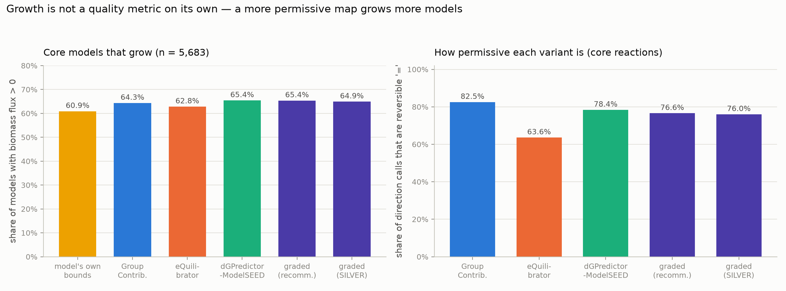
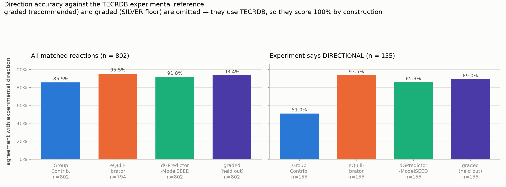
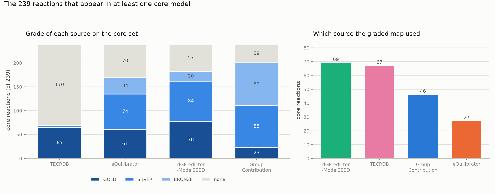

# Thermodynamic sources for ModelSEED: grading, recommendation, and core-model simulation

*A complete account of how each reaction's thermodynamic data is labelled, how one
source is chosen from several, and what each choice does to 5,683 metabolic models.
Built 2026-08-12 against ModelSEED `dev` @ 49563c6f.*

---

## How to read this document

It is organised as a pipeline. Each part is one stage, and each stage is
introduced in plain language before any mathematics appears.

| part | question it answers |
|---|---|
| [1](#part-1--the-problem-in-plain-terms) | What is the problem, and why is it not obvious? |
| [2](#part-2--the-pipeline-at-a-glance) | What does the whole system do, end to end? |
| [3](#part-3--the-inputs) | What data goes in? |
| [4](#part-4--notation) | What does each symbol mean? |
| [5](#part-5--stage-1-calibration) | How is a source's self-reported uncertainty made meaningful? |
| [6](#part-6--stage-2-grading) | How is each number labelled gold, silver or bronze? |
| [7](#part-7--stage-3-recommendation) | Which source should actually be used? |
| [8](#part-8--stage-4-direction-maps) | How does a chosen energy become a reaction direction? |
| [9](#part-9--stage-5-the-core-model-simulations) | What happens to real metabolic models? |
| [10](#part-10--all-results-in-one-place) | Every headline number, collected. |
| [11](#part-11--limitations) | What should not be concluded from this? |
| [12](#part-12--reproducing) | How is it re-run? |

Supporting data is in [`tables/`](tables/) and [`figures/`](figures/); this
document quotes everything it relies on, so the tables are for drilling in
rather than for following the argument.

---

# Part 1 — The problem, in plain terms

A metabolic model needs to know, for each reaction, **which way it can run**.
That decision comes from thermodynamics: the standard transformed Gibbs free
energy of reaction, ΔG′°. Strongly negative means the reaction runs forward,
strongly positive means it runs backward, and near zero means it can go either
way depending on concentrations.

ModelSEED does not have one ΔG′° per reaction. It has up to four, from sources
that disagree:

- **Group Contribution** — adds up energy contributions of chemical groups.
- **eQuilibrator** — component contribution, anchored on measured reactions.
- **dGPredictor-ModelSEED** — a machine-learning model over molecular fragments.
- **TECRDB** — actual laboratory measurements. Only 1,550 reactions have one.

Each *also* publishes an uncertainty, σ, saying how confident it is. So the
obvious plan is: trust whichever source says it is most confident.

**That plan does not work, and the reason is the crux of this whole document.**
A source's σ is a claim it makes about itself, computed before anyone compares it
to reality. The three sources compute σ in completely different ways, and when
you check them against real measurements, their self-assessments are wrong by
different factors and in different directions:

| source | median σ (its claim) | median true error | ratio | verdict |
|---|---:|---:|---:|---|
| Group Contribution | 8.66 | 1.57 | 0.181 | claims **4.4× more** error than it has |
| dGPredictor-ModelSEED | 0.91 | 0.47 | 0.522 | claims **1.5× more** error than it has |
| eQuilibrator | 0.36 | 0.45 | 1.261 | claims **1.6× less** error than it has |

Two sources are pessimistic, one is optimistic. Comparing their raw σ values
rewards whichever source happens to be most self-deprecating, regardless of
whether it is right.

*(This is not a hypothetical failure mode. ModelSEED's own
`Promote_Reaction_Thermodynamics_to_Canonical.py` breaks ties on the smallest
reported error, and as a result it prefers the KEGG-mis-mapped legacy dGPredictor
over its correctly-keyed replacement on 95.3% of the reactions carrying both.)*

So before the uncertainties can be used for anything, they have to be put on a
common scale by comparing them to measured error. That is **calibration**
(Part 5), and everything downstream depends on it.

## Two jobs that look like one

Once calibrated, there are two distinct things you might want:

1. **A label.** "I am looking at this ΔG′° from this source — how much should I
   trust it?" → the **grade** (Part 6).
2. **A choice.** "Three sources disagree — which one should I use?" → the
   **recommendation** (Part 7).

These feel like the same problem, and treating them as the same problem is the
main mistake this work made and then had to undo. A grade that reliably sorts
numbers by trustworthiness turned out to be a *poor* way to choose between
sources, for a reason explained in [§7.2](#72-why-the-grade-cannot-be-the-selector).
They are built separately, and they use the uncertainties differently.

---

# Part 2 — The pipeline at a glance

```
                    ModelSEED dev @ 49563c6f              TECRDB
                    ΔG′°, σ from 3 predictors             1,550 measured ΔG′°
                              │                                 │
                              ▼                                 │
      ┌───────────────────────────────────────────┐             │
      │  STAGE 1   CALIBRATION           Part 5   │◄────────────┤
      │  σ  ──►  ê   expected error               │   802 used  │
      │  σ  ──►  p   P(error ≤ 2 kcal/mol)        │   to fit    │
      │  σ  ──►  τ   a usable standard deviation  │             │
      └───────────────────┬───────────────────────┘             │
                          │                                     │
        ┌─────────────────┴─────────────────┐                   │
        ▼                                   ▼                   │
┌───────────────────────┐        ┌───────────────────────┐      │
│ STAGE 2   GRADING     │        │ STAGE 3  RECOMMEND    │      │
│ Part 6                │        │ Part 7                │      │
│                       │        │                       │      │
│ a LABEL per           │        │ a CHOICE per          │◄─────┤
│ (reaction × source)   │        │ reaction, per target  │      │
│                       │        │                       │      │
│ GOLD / SILVER /       │        │ magnitude: argmin ê   │      │
│ BRONZE / UNGRADED     │        │ direction: priority   │      │
└───────────┬───────────┘        └───────────┬───────────┘      │
            │                                │                  │
            │  best-graded source per reaction                  │
            ▼                                                   │
┌─────────────────────────────────────────────┐                 │
│ STAGE 4   DIRECTION MAPS         Part 8     │◄────────────────┘
│ feed the chosen ΔG′° through the unmodified │
│ reversibility cascade  →  '>' '<' '='       │
└───────────────────┬─────────────────────────┘
                    ▼
┌─────────────────────────────────────────────┐
│ STAGE 5   FBA OVER 5,683 CORE MODELS Part 9 │
│ 7 variants × 5,683 models = 39,781 solves   │
└─────────────────────────────────────────────┘
```

**What each stage produces:**

| stage | output | size |
|---|---|---|
| 1 Calibration | ê, p, τ per (reaction × source) | 3 fitted curves + 3 scalars |
| 2 Grading | a grade and a reason per (reaction × source) | 80,335 rows |
| 3 Recommendation | one chosen source per reaction, per target | 2 × 56,002 rows |
| 4 Direction maps | `{reaction: operator}` per variant | 6 maps, 23k–33k entries |
| 5 Simulation | growth and diagnostics per model per variant | 5,683 rows × 7 variants |

---

# Part 3 — The inputs

## 3.1 The snapshot

Reaction data comes from a read-only `git archive` of ModelSEED `dev` at commit
**49563c6f**, extracted to `/scratch/ctaylor/tmp/devsnap2`.

The **cascade code** is imported from the local checkout
`/scratch/ctaylor/ModelSEEDDatabase` instead, because the archive ships no
`Libs/Python`. The two copies' heuristic lists were compared before running and
are identical in order and content, so the choice of checkout changes no
direction call.

**Why not the live working tree** — it has neither of the two things needed:

| | live checkout | devsnap2 (`dev` @ 49563c6f) |
|---|---|---|
| Group Contribution | 25,826 non-sentinel, median σ 5.06 | **27,313**, median σ **10.28** (Convention A rebuild, `ad34d6ab`) |
| eQuilibrator | 19,498 | **25,028** |
| legacy KEGG-keyed `dGPredictor` | 27,715 | 27,715 — present but **never read** |
| `dGPredictor-ModelSEED` | absent | **31,924** |

## 3.2 The four sources

Stored per reaction as `thermodynamics[label] = [ΔG′°, σ, operator]`, kcal/mol.

| source | short | how ΔG′° is produced | how σ is produced |
|---|---|---|---|
| **Group Contribution** | GC | sum of fitted group energies | propagated uncertainty of those fitted energies; post-rebuild the resolver reports √(mean σᵢ² + var ΔGᵢ) |
| **eQuilibrator** | EQ | component contribution — a reactant-contribution layer anchored on measured reactions, group contribution only for the orthogonal complement. Run at pH 7.0, I = 0.25 M, 298.15 K, scoring ModelSEED's own stoichiometry | σ² = **ν**ᵀ**Σν** from the component-contribution covariance |
| **dGPredictor-ModelSEED** | DG | BayesianRidge over radius-1 and radius-2 atom-centred fragment count changes, retrained on ModelSEED structures, keyed directly by `rxnNNNNN` | posterior predictive standard deviation |
| **TECRDB** | TEC | NIST experimental ΔG′° = −RT ln K′ | experimental sd over contributing measurements |

### Coverage, of 56,002 non-EMPTY reactions

| source | usable ΔG′° | after vetoes (§3.4) |
|---|---:|---:|
| Group Contribution | 27,313 | 27,313 |
| eQuilibrator | 25,028 | 20,059 |
| dGPredictor-ModelSEED | 31,924 | 31,413 |
| TECRDB | 1,550 | 1,550 |
| **union** | **33,337** | **33,289** |

**22,665 reactions have no thermodynamic source at all.** That is a hard ceiling
— no method here changes it. Of the 33,289 with a feasible source, 17,389 have
all three predictors, 10,718 have two, and 5,182 have exactly one.

Sentinel values (ΔG′° = 10,000,000) are excluded throughout.

## 3.3 The experimental reference set

TECRDB comes from the eQuilibrator Zenodo deposit (doi:10.5281/zenodo.3978440),
4,544 rows of K′ with temperature and pH, keyed by KEGG compound ids.

Matching to ModelSEED is **by structure, not identifier**. Each compound is
resolved to an RDKit structure key; a reaction becomes a (reactant multiset,
product multiset) pair with protons dropped, matched in both directions:

| tier | key | reactions | what it can confuse |
|---|---|---:|---|
| `stereo_exact` | full InChIKey of the neutralised parent | **802** | nothing — distinguishes anomers and D/L pairs |
| `skeleton` | InChIKey connectivity block only | 748 | stereoisomers — this is how hexokinase/aldose data got conflated to glucose |

**Only the 802 `stereo_exact` matches are used for fitting and validation.**

Experimental scatter is small: median σ 0.15 kcal/mol, p90 1.04, max 3.15. But
551 of the 1,550 rest on a *single* measurement, so `n_measurements` and the sd
are both carried into the output for consumers who want a stricter floor.

Measured error of each predictor against this set:

| source | n | median \|error\| | within 2 kcal/mol |
|---|---:|---:|---:|
| eQuilibrator | 794 | 0.45 | 85.6% |
| dGPredictor-ModelSEED | 802 | 0.47 | 84.8% |
| Group Contribution | 802 | 1.57 | 56.6% |

No predictor dominates. That is precisely why arbitration is worth doing.

## 3.4 Known defects, and the vetoes that encode them

Each of these removes a source from a reaction outright rather than inflating
its uncertainty, because in each case the stored value is not a noisy estimate —
it is not an estimate at all.

| veto | reactions | why |
|---|---:|---|
| **eQuilibrator sentinel**, σ > 100 | 4,934 | eQuilibrator marks compounds it cannot estimate by inflating variance by 10⁶. Stored σ is strictly bimodal: real values cap at **65.35**, sentinels start at **7,504.61**. The cut at 100 sits in a two-orders-of-magnitude empty gap — it is not a tuned threshold. This is the source explicitly disclaiming the reaction. |
| **eQuilibrator MetaNetX collision** | 35 | the retrieval script writes `lhs[mnx_id] = |coeff|` instead of accumulating, so two ModelSEED compounds sharing one MetaNetX id silently overwrite each other |
| **dGPredictor-ModelSEED on quinone/quinol** | 511 | 52.8% sign disagreement with eQuilibrator on that couple, median σ 80.3 — the retrain regressed on two-electron aromatic redox |
| legacy `dGPredictor` KEGG mis-mapping | n/a | 17,271 reactions carry a value predicted from a KEGG reaction ModelSEED does not list. **Not applicable** — that label is never read, and `dGPredictor-ModelSEED` is keyed by ModelSEED id and structurally immune. No mask needed. |

## 3.5 The core models

5,683 Kegg2 core models on KBase complete media.

A model's **unique reactions** are its distinct `seed.reaction` annotations,
normalised to strip a stray compartment suffix on 17 transport annotations
(`rxn11322_c` → `rxn11322`). Exchange, sink, demand and biomass pseudo-reactions
carry no annotation and are excluded.

| | min | median | mean | max |
|---|---:|---:|---:|---:|
| unique reactions per model | 20 | 128 | 123.1 | 187 |
| unique compounds per model | 41 | 124 | 119.2 | 163 |

Combined across all models: **239 distinct reactions**, 182 distinct compounds.
The models are homogeneous central metabolism, which is why the union is so much
smaller than 5,683 × the per-model average.

**One fact that shapes every core-model result:** 69 of the 239 core reactions
(28.9%) have a TECRDB measurement, against 1,550 of 56,002 (2.8%) database-wide
— a **10× enrichment**, because central metabolism is exactly what NIST measured.

---

# Part 4 — Notation

Units are kcal/mol throughout.

### Index sets

| symbol | meaning |
|---|---|
| 𝓡 | non-EMPTY ModelSEED reactions, \|𝓡\| = 56,002 |
| *i* | one reaction |
| 𝓢 = {GC, EQ, DG} | the three **predictors** |
| 𝓢⁺ = 𝓢 ∪ {TEC} | predictors plus the measurement |
| 𝓐 | the **anchor set** — 802 reactions with a `stereo_exact` TECRDB match |
| 𝓒 | the **core set** — 239 reactions in ≥ 1 core model |

### Observables — readable for every reaction

| symbol | meaning |
|---|---|
| ΔG*ₛ*(*i*) | source *s*'s energy estimate |
| σ*ₛ*(*i*) | source *s*'s **own reported** standard deviation |
| A(*i*) | sources with a usable value |
| V(*i*) | sources vetoed on *i* (§3.4) |
| F(*i*) = A(*i*) \ V(*i*) | the **feasible** sources; *n*(*i*) = \|F(*i*)\| |

### Truth — available only on 𝓐

| symbol | meaning |
|---|---|
| ΔG\*(*i*) | the measured ΔG′° |
| ε*ₛ*(*i*) = \|ΔG*ₛ*(*i*) − ΔG\*(*i*)\| | the **true absolute error** |

> **σ is a claim; ε is the truth.** Every calibrated quantity below is a bridge
> from one to the other.

### The cascade

The reversibility cascade is a deterministic function

> **𝒞( δ, e ; i ) ∈ { '>', '<', '=' }**

giving the direction for reaction *i* from an energy δ and a reported error *e*.
Internally: `atp_synthase → abc_transporter → stored_bounds → mmdeltag_band →
low_energy → default`, first match wins.

| symbol | meaning |
|---|---|
| Λ*ₛ*(*i*) = 𝒞(ΔG*ₛ*, σ*ₛ* ; *i*) | the direction source *s* implies |
| Λ\*(*i*) = 𝒞(ΔG\*, σ\* ; *i*) | the **reference direction** — the same cascade fed the *experiment* |

Λ\* is the yardstick for every direction-accuracy number here. Holding the
cascade fixed and varying only the energy isolates the contribution of the
thermodynamic source, which is the question being asked. It is deliberately not
a literature-curated direction.

Quantities the cascade derives from stoichiometry alone (used in §7.4):

| symbol | definition |
|---|---|
| *a*(*i*) | RT·(pdt_max + rct_min), the stored-bounds **maximum** concentration term |
| *b*(*i*) | RT·(pdt_min + rct_max), the same for the **minimum** |
| *c*(*i*) | RT·rgt_sum, so mMΔG = ΔG′° + *c* |
| *P*(*i*) | the low-energy points score; may be negative |

### Calibrated quantities (Part 5)

| symbol | meaning |
|---|---|
| ĝ*ₛ* | non-decreasing map σ ↦ expected \|error\| |
| ê*ₛ*(*i*) = ĝ*ₛ*(σ*ₛ*) | predicted expected absolute error |
| ĥ*ₛ* | non-increasing map σ ↦ P(\|error\| ≤ τ) |
| *p*ₛ(*i*) = ĥ*ₛ*(σ*ₛ*) | probability *s* is within τ of the truth |
| τ = 2.0 | the "close enough" tolerance |
| *k*ₛ | one scalar per source correcting the Gaussian scale |
| τ*ₛ*(*i*) = *k*ₛ·ê*ₛ*/√(2/π) | the **calibrated standard deviation** |

**τ = 2.0 is not arbitrary.** It is the half-width of the cascade's own
reversible band (`−2.0 ≤ mMΔG ≤ 2.0`), so *p*ₛ reads as *"the probability this
number is good enough to call the direction."*

### Consistency statistics (§6.3)

| symbol | definition |
|---|---|
| *w*ₛ = 1/ê*ₛ*² | precision weight — the **calibrated** error, never raw σ |
| ΔḠ = Σ *w*ₛΔG*ₛ* / Σ *w*ₛ | precision-weighted combination |
| χ² = Σ *w*ₛ(ΔG*ₛ* − ΔḠ)² | weighted dispersion, df = *n* − 1 |
| **R = √(χ²/(n−1))** | the **Birge ratio** (PDG scale factor) |
| *z*ₛ = \|ΔG*ₛ* − ΔḠ\|/ê*ₛ* | per-source residual — *which* source is the outlier |
| Z | **structural-zero** flag: all feasible sources report \|ΔG′°\| < 0.5, or transport |

R ≈ 1 means the spread among sources is exactly what their stated uncertainties
predict. R ≫ 1 means at least one is wrong.

ΔḠ is an internal construct — a reference point for computing *z*ₛ. **No fused
energy is shipped anywhere.**

### Outputs

| symbol | meaning |
|---|---|
| G*ₛ*(*i*) | the **grade** ∈ {GOLD, SILVER, BRONZE, UNGRADED} |
| ρ*ₛ*(*i*) = 1 − P(Λ\* = Λ*ₛ*) | the **direction risk** |
| *T* | the recommendation **target** ∈ {magnitude, direction} |

### One naming collision, resolved

An older script uses "gold"/"silver" for its two **calibration-data tiers**.
Those are fitting *inputs*. Here they are called **anchor** (TECRDB, weight 3)
and **proxy** (a trusted-σ source standing in, weight 1). Gold/silver/bronze
refer only to the emitted grade.

---

# Part 5 — Stage 1: Calibration

**What this stage does, in one sentence:** it learns, separately for each
source, how that source's self-reported σ translates into real error — so that
"σ = 1" from eQuilibrator and "σ = 1" from Group Contribution can finally be
compared.

## 5.1 The estimator

Both calibrations are **isotonic regressions**: monotone and non-parametric.

> ĝ*ₛ* = argmin over non-**decreasing** *f* of Σⱼ *w*ⱼ ( εⱼ − *f*(σⱼ) )²
>
> ĥ*ₛ* = argmin over non-**increasing** *f* of Σⱼ *w*ⱼ ( 𝟙[εⱼ ≤ τ] − *f*(σⱼ) )²

- **Monotone** because a source reporting *more* uncertainty must never be
  predicted to be *more* accurate. That is the one thing we are sure of.
- **Non-parametric** because there is no theory saying the relationship should
  be linear, quadratic, or anything else — imposing a shape would invent
  structure.

The two differ only in the response variable: ĝ predicts the *size* of the
error, ĥ predicts the *probability* of being close enough.

## 5.2 Two tiers of training data, and why one is not enough

TECRDB covers well-measured central metabolism, which is exactly the **low-σ**
regime. It cannot constrain the range the model has to work over:

| source | anchor σ p50 | anchor σ p90 | database σ p50 | database σ p90 | database σ max |
|---|---:|---:|---:|---:|---:|
| dGPredictor-ModelSEED | 0.91 | 1.22 | 21.17 | 52.89 | 2,039 |
| eQuilibrator | 0.36 | 0.70 | 0.59 | 1.58 | 65.3 |
| Group Contribution | 8.66 | 13.06 | 10.28 | 20.24 | 566.6 |

*(Database columns exclude sentinels. Including eQuilibrator's 4,934 σ-sentinels
its p90 becomes 23,901, which describes the sentinel flag, not the source.)*

**75.6% of database reactions for dGPredictor-ModelSEED** (43.4% eQuilibrator,
29.5% Group Contribution) lie beyond the anchor's σ p90. Fitting on the anchor
alone and clipping would assign all of those the error learned at σ ≈ 1.2 —
i.e. it would be most optimistic exactly where the source is least reliable.
For a safety filter that is backwards.

So each fit uses two tiers:

| tier | response εⱼ | weight | what it is |
|---|---|---:|---|
| **anchor** | \|ΔG*ₛ* − ΔG\*\| on 𝓐 | 3 | a measurement |
| **proxy** | \|ΔG*ₛ* − ΔG_ref\| where the reference is inside its trusted-σ band | 1 | an *upper bound* on the error, not a measurement |

The proxy reference is eQuilibrator for GC and DG, and dGPredictor-ModelSEED for
EQ. "Trusted band" means σ_EQ ≤ 0.70 or σ_DG ≤ 1.22 — each source's own anchor
p90, i.e. the range where measurements actually constrain it. TECRDB establishes
that eQuilibrator below σ 0.70 is accurate to a median 0.45 kcal/mol; *that* is
what earns it the right to stand in as a reference where measurements run out.
Proxy points carry ⅓ the weight because an upper bound is weaker evidence, and
each row records which tier it came from.

## 5.3 The fitted probability curves

| source | anchor n | proxy n | *p* at min σ | *p* at max σ | knots | anchor fraction within τ |
|---|---:|---:|---:|---:|---:|---:|
| eQuilibrator | 794 | 4,011 | 0.999 | 0.000 | 24 | 0.856 |
| dGPredictor-ModelSEED | 802 | 11,183 | 0.988 | 0.000 | 44 | 0.848 |
| Group Contribution | 802 | 10,025 | 0.845 | 0.511 | 18 | 0.566 |

**Group Contribution's curve is nearly flat** — 0.845 down to 0.511 across the
entire database. This is the honest output, not a failed fit: GC's σ correlates
with its measured error at only ρ = +0.176. The structural consequence is that
**GC can never reach GOLD from its own σ**, and in the results it never does.

*(Using ê instead of p would be worse. On the Convention A rebuild GC's ê spans
only 3.04 → 5.70 kcal/mol database-wide — a curve that cannot rank anything, and
one that places GC below any ê threshold under 3 for the wrong reason.)*

## 5.4 From ê to a usable standard deviation

Parts 7 needs a probability distribution over the truth, not just an expected
error. Using the Gaussian identity E\|X\| = τ√(2/π) ≈ 0.798τ:

> **τ*ₛ*(*i*) = *k*ₛ · ê*ₛ*(*i*) / √(2/π)**, floored at 0.05

*k*ₛ is one scalar per source, fitted so that the interval ΔG*ₛ* ± τ*ₛ* actually
covers the nominal 68.3% of measured errors on the anchor:

| source | *k*ₛ | anchor n | coverage before | coverage after | target |
|---|---:|---:|---:|---:|---:|
| Group Contribution | 0.539 | 802 | 0.762 | 0.683 | 0.683 |
| eQuilibrator | 0.598 | 794 | 0.866 | 0.694 | 0.683 |
| dGPredictor-ModelSEED | 0.648 | 802 | 0.813 | 0.687 | 0.683 |

All three needed shrinking by about a third — ê is systematically conservative,
because the proxy tier supplies most of its fitting points and a proxy is an
upper bound. Before/after coverage is printed on every run, so this calibration
is checkable rather than asserted.

---

# Part 6 — Stage 2: Grading

**What this stage does, in one sentence:** it attaches a trust label to every
individual number, independently, so that on one reaction eQuilibrator can be
GOLD while Group Contribution is BRONZE.

## 6.1 What comes out

```
rxn00001   diphosphate phosphohydrolase                          EC 3.6.1.1

  source                   ΔG′°     σ      ê      p      z      grade   reason
  TECRDB                  -3.53   0.90    —      —      —       GOLD    measured
  eQuilibrator            -4.07   0.05   0.44   0.999  0.37     GOLD    measured
  dGPredictor-ModelSEED   -3.77   0.87   0.56   0.988  0.25     GOLD    measured
  Group contribution       4.18   2.24   4.47   0.553  1.81     BRONZE  measured
```

This is a real row set, and it makes the point of per-source grading: Group
Contribution has the *wrong sign* here — +4.18 against a measured −3.53 — and
gets BRONZE, while the other two get GOLD on the same reaction. A single
reaction-level grade would have to average that away.

## 6.2 The grading pipeline

```
INPUTS                        ΔG_s(i), σ_s(i), ν(i)              TECRDB ΔG*(i)
       │                                                              │
       ▼                                                              │
┌─ A. FEASIBILITY ────────────────────────────────────────────┐       │
│  drop s if: eQ σ > 100 (4,934) · eQ MetaNetX (35)           │       │
│             dGPredictor-ModelSEED on a quinone (511)        │       │
│  F(i) = ∅  ──────────────────────────────────► UNGRADED     │       │
└──────────────────────────┬──────────────────────────────────┘       │
       ┌───────────────────┴───────────────────┐                      │
       ▼                                       ▼                      │
┌─ B. CALIBRATE  (Part 5) ─────┐   ┌─ C. FUSE ─────────────────┐      │
│  ĝ_s : σ ↦ ê                 │ ê │  w_s = 1 / ê_s²           │      │
│  ĥ_s : σ ↦ p                 ├──►│  ΔḠ, χ², R, z_s, Z        │      │
└──────────────┬───────────────┘   └─────────────┬─────────────┘      │
               │  p_s(i)                         │  R(i), z_s(i), Z   │
               └───────────────┬─────────────────┘                    │
                               ▼                                      │
┌─ D. CASCADE  (independently for each s ∈ F(i)) ────────────────┐     │
│   p ≥ 0.90 ? ──yes──► GOLD    "self-certain"                   │     │
│   p ≥ 0.70 ? ──yes──► SILVER  "self-confident"                 │     │
│   otherwise  ───────► BRONZE  "uncorroborated"                 │     │
│                                                                │     │
│   FLOOR   BRONZE and n ≥ 2 and Z = 0 and R ≤ 1.5 and z_s ≤ 1   │     │
│                      ─────► SILVER "corroborated"  never higher│     │
│   DEMOTE  n ≥ 2 and R > 2 and z_s > 3                          │     │
│                      ─────► one tier down "outvoted"           │     │
└────────────────────────────┬───────────────────────────────────┘     │
                             ▼                                         │
┌─ E. MEASUREMENT OVERRIDE  (terminal, applied last so it wins) ─┐◄─────┘
│   ε_s ≤ 1 ──► GOLD    ε_s ≤ 3 ──► SILVER    ε_s > 3 ──► BRONZE │
│                                            all "measured"      │
└────────────────────────────┬───────────────────────────────────┘
                             ▼
             G_s(i)  +  reason        TECRDB bypasses B–D entirely
```

Two ordering facts worth stating because they are invisible in prose:
**calibration is fitted once per source but applied per reaction**, and **the
measurement override is written last in the code specifically so it overwrites
whatever the cascade concluded.**

## 6.3 Cross-source consistency, used asymmetrically

Sources are treated as independent measurements of the same quantity, weighted
by their **calibrated** error ê (not raw σ — that is what makes them
commensurable). R and *z*ₛ are defined in [Part 4](#consistency-statistics-63).

Validated on the anchor, R ranks true error where ê does not:

| R | n | median \|ΔḠ − ΔG\*\| | mean | within 2 |
|---|---:|---:|---:|---:|
| R ≤ 1 | 579 | **0.36** | 0.67 | 93% |
| 1 < R ≤ 2 | 157 | 0.64 | 1.07 | 84% |
| 2 < R ≤ 5 | 59 | **3.18** | 3.04 | 42% |
| R > 5 | 7 | **5.69** | 5.16 | **0%** |

A 16× monotone spread in median error. For contrast, splitting the same
reactions on ê separates dGPredictor's accepted from rejected sets by 0.46 vs
0.60 — essentially not at all.

Database-wide, of the 28,107 reactions with *n* ≥ 2: **16,207** at R ≤ 1, 6,731
at 1 < R ≤ 2, 4,283 at 2 < R ≤ 5, 886 discrepant at R > 5.

### The asymmetry

> **Agreement lifts BRONZE to SILVER and never creates GOLD.
> Being outvoted costs one tier.**

Agreement between two fallible predictors is weak evidence — eQuilibrator and
Group Contribution share group-contribution lineage, so they can be wrong the
same way, and **28.5% of the R ≤ 1 set (4,617 of 16,207) are structural zeros**
where the agreement is imposed by the stoichiometry rather than earned.
Disagreement is strong evidence: someone is definitely wrong, and *z*ₛ says who.

This was tested rather than assumed. Letting corroboration promote all the way
to GOLD grew eQuilibrator's GOLD column from 2,443 to 9,157 but diluted its
measured guarantee from 94% to 90% within 2 kcal/mol (dGPredictor-ModelSEED 98%
→ 91%). So the promotion half is capped.

## 6.4 The cascade, rule by rule

```
Rule 0  UNGRADED   s ∉ F(i)

Rule 1  MEASURED   i ∈ 𝓐 :  ε_s ≤ 1 → GOLD | ε_s ≤ 3 → SILVER | else BRONZE
                   terminal

Rule 2  BASE       p_s ≥ 0.90 → GOLD    "self-certain"
                   p_s ≥ 0.70 → SILVER  "self-confident"
                   else       → BRONZE  "uncorroborated"

Rule 3  FLOOR      BRONZE and n ≥ 2 and Z = 0 and R ≤ 1.5 and z_s ≤ 1
                              → SILVER  "corroborated"      (never higher)

Rule 4  DEMOTE     n ≥ 2 and R > 2 and z_s > 3
                              → one tier down  "outvoted"
```

TECRDB is graded separately and trivially: GOLD everywhere it exists, except
that `skeleton`-tier matches are capped at SILVER. The *measurement* is gold in
both tiers; the *match* is not. `--tecrdb-skeleton-gold` disables the cap.

Shipped thresholds: `p_gold 0.90, p_silver 0.70, r_corrob 1.5, z_corrob 1.0,
r_outvote 2.0, z_outvote 3.0, meas_gold 1.0, meas_silver 3.0`.

## 6.5 Worked examples

**Corroboration lifting all three** — rxn00011, pyruvate dehydrogenase (E1):

| source | ΔG′° | σ | ê | p | z | R | grade | reason |
|---|---:|---:|---:|---:|---:|---:|---|---|
| Group contribution | 6.90 | 7.64 | 5.70 | 0.522 | 0.08 | 0.52 | SILVER | corroborated |
| eQuilibrator | 6.99 | 0.82 | 2.99 | 0.401 | 0.19 | 0.52 | SILVER | corroborated |
| dGPredictor-ModelSEED | 0.04 | 33.27 | 8.99 | 0.188 | 0.71 | 0.52 | SILVER | corroborated |

All three have p below 0.70, so all three start BRONZE; R = 0.52 lifts them all
to SILVER. **Note the caution this example carries:** dGPredictor says 0.04 while
eQuilibrator says 6.99 — a 7 kcal/mol disagreement — yet R is low, because
dGPredictor's ê is 8.99 and a wide uncertainty makes a source trivially
"consistent". R rewards humility as well as accuracy.

**Demotion firing** — rxn00748, methylglyoxal synthase:

| source | ΔG′° | σ | ê | p | z | R | grade | reason |
|---|---:|---:|---:|---:|---:|---:|---|---|
| Group contribution | −1.30 | 1.36 | 3.04 | 0.644 | **3.08** | 2.63 | BRONZE | outvoted |
| eQuilibrator | −14.30 | 0.46 | 2.26 | 0.742 | 1.62 | 2.63 | SILVER | self-confident |
| dGPredictor-ModelSEED | −16.47 | 14.10 | 4.44 | 0.383 | 1.31 | 2.63 | BRONZE | uncorroborated |

The other two agree near −15; Group Contribution says −1.30 and is identified as
the outlier by z = 3.08 with R = 2.63 > 2.

**Inference only, no measurement** — rxn00247, PEP carboxykinase:

| source | ΔG′° | σ | p | z | R | grade | reason |
|---|---:|---:|---:|---:|---:|---|---|
| Group contribution | −9.82 | 8.71 | 0.522 | 2.05 | 1.51 | BRONZE | uncorroborated |
| eQuilibrator | 2.47 | 0.75 | 0.520 | 0.21 | 1.51 | BRONZE | uncorroborated |
| dGPredictor-ModelSEED | 2.96 | 1.26 | 0.750 | 0.57 | 1.51 | SILVER | self-confident |

R = 1.51 is just above the 1.5 corroboration threshold, so nothing is lifted;
only dGPredictor's own confidence clears 0.70.

## 6.6 Which rule actually decides — the flag audit

The `reason` column is the audit trail. Counting it says which parts of the
machinery are load-bearing. Pooled over the three predictors (78,785 graded
rows; TECRDB's 1,550 are separate):

| reason (flag) | rule | GOLD | SILVER | BRONZE |
|---|---|---:|---:|---:|
| `self-certain` | p ≥ 0.90 | **7,119** | — | — |
| `measured` | ε vs TECRDB | **1,421** | 574 | 398 |
| `self-confident` | p ≥ 0.70 | — | 11,301 | — |
| `corroborated` | R ≤ 1.5, z ≤ 1, was BRONZE | — | **26,984** | — |
| `outvoted` | R > 2, z > 3 | — | — | 4,086 |
| `uncorroborated` | nothing else fired | — | — | **26,902** |

TECRDB: 802 `measured` → GOLD, 748 `measured (skeleton match)` → SILVER.

Per source:

| source | flag | GOLD | SILVER | BRONZE |
|---|---|---:|---:|---:|
| **eQuilibrator** | self-certain | 1,848 | — | — |
| | measured | 575 | 166 | 48 |
| | self-confident | — | 8,556 | — |
| | corroborated | — | 4,792 | — |
| | outvoted | — | — | 727 |
| | uncorroborated | — | — | 3,347 |
| **dGPredictor-ModelSEED** | self-certain | 5,271 | — | — |
| | measured | 537 | 187 | 78 |
| | self-confident | — | 2,094 | — |
| | corroborated | — | 10,123 | — |
| | outvoted | — | — | 1,948 |
| | uncorroborated | — | — | 11,175 |
| **Group contribution** | measured | 309 | 221 | 272 |
| | self-confident | — | 651 | — |
| | corroborated | — | 12,069 | — |
| | outvoted | — | — | 1,411 |
| | uncorroborated | — | — | 12,380 |

**Only two flags can produce GOLD.** `self-certain` supplies 83% and `measured`
17%. Corroboration produces exactly zero — the asymmetry is visible in the
output, not merely asserted in the design.

**Group Contribution has no `self-certain` rows at all.** Its p never reaches
0.90 anywhere in the database, so all 309 of its GOLDs are TECRDB matches. This
is §5.3's flat curve showing up as a hard structural fact.

**`measured` is the only flag mapping to more than one grade**, and it is not a
rubber stamp. For Group Contribution it produced 309 GOLD / 221 SILVER / 272
BRONZE — a third of its measured reactions are off by more than 3 kcal/mol. It
is the only rule that can *demote* a source that σ said was fine.

## 6.7 Which half of the asymmetry actually does the work

> **Correction.** An earlier version of this analysis said the *demotion* rule
> carried most of the discriminating power, citing Group Contribution's BRONZE
> median error moving from 1.66 to 8.68 kcal/mol. That attribution was wrong.
> The 1.66 → 8.68 shift comes from the corroboration **lift**, not the demotion.

Isolating the two rules, BRONZE-tier median \|error\| on the anchor:

| source | p only | + lift | + lift + demote (shipped) |
|---|---|---|---|
| Group contribution | 1.66 (n=779) | **8.68** (n=285) | 8.68 (n=285) |
| eQuilibrator | 2.26 (n=21) | 3.47 (n=11) | 3.33 (n=14) |
| dGPredictor-ModelSEED | 2.57 (n=5) | 16.23 (n=2) | **20.78** (n=10) |

The **lift** does nearly all the work. It fires 27,491 times, and by moving
corroborated reactions *out* of BRONZE it concentrates the genuinely bad ones
there — that is what purifies the tier.

The **demotion** is much smaller than its flag count suggests: it fires on 4,137
rows but only 298 of them (**7%**) actually change tier, because the other 93%
were already BRONZE. Its one measurable contribution is to dGPredictor-ModelSEED,
where it adds 8 genuinely bad reactions and lifts the BRONZE median from 16.23 to
20.78.

So the honest summary of the asymmetric design: **capping the promotion is what
protects GOLD, and the lift is what purifies BRONZE.** The demotion is mostly a
label, useful for flagging outliers but rarely changing a decision.

## 6.8 Validation

Grades recomputed on the anchor with **Rule 1 disabled**, so the label is
inferred from p and the consistency statistics only, then scored against the
measurement it was not allowed to see:

| source | grade | n | median \|ε\| | mean | within 1 | within 2 | p90 |
|---|---|---:|---:|---:|---:|---:|---:|
| eQuilibrator | GOLD | 246 | **0.32** | 0.56 | 87% | 94% | 1.45 |
| | SILVER | 529 | 0.46 | 0.95 | 68% | 85% | 2.54 |
| | BRONZE | 14 | **3.33** | 3.54 | 0% | **0%** | 4.83 |
| dGPredictor-ModelSEED | GOLD | 184 | **0.32** | 0.56 | 78% | 98% | 1.36 |
| | SILVER | 608 | 0.55 | 1.35 | 65% | 82% | 3.09 |
| | BRONZE | 10 | **20.78** | 18.80 | 0% | **0%** | 21.45 |
| Group Contribution | GOLD | 0 | — | — | — | — | — |
| | SILVER | 517 | 1.28 | 1.62 | 42% | 69% | 3.59 |
| | BRONZE | 285 | **8.68** | 7.73 | 33% | 34% | 15.23 |

Monotone in every column, for every source, on data withheld from the label.
GOLD → BRONZE separates by 10× for eQuilibrator and 65× for
dGPredictor-ModelSEED.

One honest wrinkle: Group Contribution's BRONZE has a *higher* within-1 rate
(33%) than its median suggests, because that tier is bimodal — a third of it is
nearly exact and the rest is badly wrong. Read the median and p90, not the mean.

**As a trust label, the grade works.** That is the only claim §6.8 supports.

## 6.9 Results

| source | GOLD | SILVER | BRONZE | UNGRADED |
|---|---:|---:|---:|---:|
| TECRDB | 802 | 748 *(skeleton)* | 0 | 54,452 |
| eQuilibrator | 2,423 | 13,514 | 4,122 | 35,943 |
| dGPredictor-ModelSEED | 5,808 | 12,404 | 13,201 | 24,589 |
| Group Contribution | 309 | 12,941 | 14,063 | 28,689 |

Per reaction, taking the best grade available: **6,771 GOLD, 16,332 SILVER,
10,186 BRONZE**, and 22,713 with no source at all.

---

# Part 7 — Stage 3: Recommendation

**What this stage does, in one sentence:** it picks one source per reaction —
and, unlike the grade, it does *not* use the uncertainties to make that pick for
direction, because every attempt to do so was measurably worse than a fixed
priority order.

## 7.1 The decision problem

> *s*\*(*i*) = argmin over *s* ∈ F(*i*) of **𝓛_T( *s*, *i* )**
>
> use *s*\* if 𝓛_T ≤ *E*\*, otherwise abstain

where 𝓛_T is the expected loss under the **target** — what the caller will do
with the number:

| target | loss | 𝓛_T |
|---|---|---|
| **magnitude** | \|ΔG*ₛ* − ΔG\*\| | ê*ₛ*(*i*) |
| **direction** | 𝟙[Λ*ₛ* ≠ Λ\*] | ρ*ₛ*(*i*) = 1 − P(Λ\* = Λ*ₛ*) |

For magnitude the argmin rule is correct and ships. For direction it is not, and
§7.5–7.6 replace it.

## 7.2 Why the grade cannot be the selector

The grade is calibrated on **magnitude**. On that target dGPredictor-ModelSEED
genuinely is the better source: 98% of its GOLD tier within 2 kcal/mol against
eQuilibrator's 94%.

So a grade-ranked pick chooses dGPredictor-ModelSEED on **521 of the 802** anchor
reactions and eQuilibrator on 274. But eQuilibrator's *direction* call is right
**98.9%** of the times it is picked, and dGPredictor-ModelSEED's only **90.4%**.
The ranking systematically prefers the weaker source for this job.

The cause is structural: **direction errors concentrate where magnitude error is
smallest**, at ΔG′° ≈ 0, which is exactly where the cascade's ±2 band decides.
Optimising E\|error\| does not optimise P(right side of the band). One statistic
cannot serve both targets.

## 7.3 The direction risk, computed exactly

Even though it does not end up selecting the source, ρ is worth computing
properly — it is what drives abstention.

**The key observation:** holding stoichiometry fixed, the cascade's operator is a
**piecewise-constant function of ΔG′°**. Every heuristic that reads the energy
compares it against a threshold, so 𝒞 can only change value at finitely many
points, all in closed form:

| breakpoint in ΔG′° | which comparison |
|---|---|
| −*e* − *a*(*i*) | stored-bounds maximum crosses 0 |
| +*e* − *b*(*i*) | stored-bounds minimum crosses 0 |
| −2 − *c*(*i*) | lower edge of the mMΔG band |
| +2 − *c*(*i*) | upper edge of the mMΔG band |
| −*c*(*i*) | mMΔG sign flip, selecting the low-energy branch |
| 2/*P*(*i*) − *c*(*i*) | the low-energy threshold (omitted when *P* = 0) |

Sort them into an ordered partition −∞ = *t*₀ < *t*₁ < … < *t*ₘ₊₁ = +∞ and
evaluate the **real cascade** once at an interior point of each interval,
ω_j = 𝒞(midpoint(*I*_j), σ\* ; *i*). Because the operator is constant on each
interval, ω_j is the operator on all of *I*_j — exact, not a discretisation.
Evaluating the actual cascade rather than a re-derivation also means this cannot
drift if a heuristic changes.

Then, modelling the truth as ΔG\* ~ N(ΔG*ₛ*, τ*ₛ*²):

> **P(Λ\* = Λ*ₛ*) = Σ_{j : ω_j = Λ*ₛ*} [ Φ((t_{j+1} − ΔG*ₛ*)/τ*ₛ*) − Φ((t_j − ΔG*ₛ*)/τ*ₛ*) ]**

A closed-form sum of normal CDFs — no Monte Carlo, no sampling error, exact with
respect to the full cascade. ATP synthase and ABC transporter reactions match
before any energy is read, so they yield one interval and ρ = 0 exactly.

| source | n | median ρ | share with ρ ≤ 0.05 |
|---|---:|---:|---:|
| eQuilibrator | 20,059 | 0.000 | 76.6% |
| Group Contribution | 27,313 | 0.048 | 50.3% |
| dGPredictor-ModelSEED | 31,413 | 0.081 | 47.4% |

## 7.4 The negative result

Held-out direction accuracy on the anchor, 20 random 70/30 splits. Coverage is
the share of held-out reactions the strategy will answer for.

| strategy | accuracy | coverage |
|---|---:|---:|
| **priority EQ > DG > GC** | **95.9% ± 1.1** | **100%** |
| eQuilibrator only | 95.9% ± 1.2 | 98.3% |
| priority + risk veto at ρ > 0.20 | 94.2% ± 1.1 | 100% |
| priority + risk veto at ρ > 0.05 | 93.8% ± 1.4 | 100% |
| argmin τ*ₛ* | 93.7% ± 1.1 | 100% |
| argmin ê*ₛ* (the magnitude rule) | 93.7% ± 1.1 | 100% |
| priority + risk veto at ρ > 0.02 | 93.0% ± 1.3 | 100% |
| dGPredictor-ModelSEED only | 91.6% ± 1.1 | 100% |
| **argmin ρ*ₛ* (the risk rule)** | **90.9% ± 1.2** | 100% |
| Group Contribution only | 85.1% ± 2.3 | 100% |

**Every uncertainty-based arbitration lost to a fixed priority order**, and
argmin ρ came second-to-last — below simply always using dGPredictor-ModelSEED.
**Layering a risk veto on top of priority made things monotonically worse**
(94.2 → 93.8 → 93.0 as it tightens), because a veto can only ever move a
reaction off the better source and onto a worse one.

### Why argmin ρ fails

ρ*ₛ* is P(this source's own call is overturned by this source's own
uncertainty). That is **precision, not accuracy**. The integral is centred on
ΔG*ₛ*, so it measures how far that point estimate sits from a breakpoint
relative to its own noise — and it is structurally blind to the point estimate
being displaced from the truth in the first place.

A source that is confidently wrong — small τ, far from any breakpoint, wrong
region — scores ρ ≈ 0 and beats a source that is right but sits near a band
edge. The quantity is well-defined and correctly computed. It is simply not the
quantity that selects a source.

## 7.5 The algorithm as shipped

```
RECOMMEND( reaction i, target T ):

  0  MEASUREMENT   if TECRDB has i, return the experimental ΔG′°.

  1  FEASIBILITY   F(i) = A(i) \ V(i)                        [uses uncertainty]
                   eQ σ > 100 · eQ MetaNetX · dGPMS quinone
                   F(i) = ∅ → return nothing

  2  CALIBRATE     τ_s(i) = k_s · ê_s(i) / √(2/π)            [uses uncertainty]

  3  SELECT        magnitude : s* = argmin ê_s(i)            [uses uncertainty]
                   direction : s* = first feasible in (EQ, DG, GC)   [does NOT]

  4  RISK          compute ρ_{s*}(i) by the §7.3 integral

  5  ABSTAIN       direction : return nothing if ρ > 0.35    [uses uncertainty]
                   magnitude : return nothing if ê > 2.0
```

The priority order is **empirical**, taken from measured accuracy on the anchor
(eQuilibrator 95.5% > dGPredictor-ModelSEED 91.8% > Group Contribution 85.5%),
not from a preference. §7.7 is the caveat on it.

## 7.6 What the uncertainty is and is not for

> **The reported uncertainties are usable *within* a source and not *between*
> sources.**

Three jobs they do, all validated:

1. **Feasibility.** The eQuilibrator sentinel is the single most valuable
   uncertainty signal in the database — 4,934 reactions where the source states
   outright that it has no estimate.
2. **Abstention.** Within a source, σ is informative:

   | eQ σ quartile | range | n | eQuilibrator | dGPredictor-MS | Group Contribution |
   |---|---|---:|---:|---:|---:|
   | Q1 | 0.00–0.17 | 205 | **100.0%** | 98.5% | 83.9% |
   | Q2 | 0.17–0.36 | 208 | 98.6% | 91.8% | 88.5% |
   | Q3 | 0.36–0.57 | 209 | 91.9% | 92.3% | 87.1% |
   | Q4 | 0.57–1.12 | 200 | 92.0% | 84.5% | 83.5% |

3. **Magnitude arbitration.** argmin ê beats every fixed baseline on mean
   error: **1.03** kcal/mol against 1.74 for always-eQuilibrator, 1.27 for
   always-dGPredictor-ModelSEED, and 1.73 for the priority rule ModelSEED `dev`
   currently uses (held-out, n = 241). Note this is a *mean*-not-median gain —
   medians are 0.45 vs 0.47 — i.e. the arbitration is removing catastrophic
   cases rather than improving typical ones.

## 7.7 The caveat on the priority order

**eQuilibrator is fitted on TECRDB.** Its reactant-contribution layer is anchored
to exactly these measurements, and dGPredictor was trained on 4,001 of them.
Only Group Contribution is genuinely out-of-sample. The benchmark that produced
the priority order is therefore partly in-sample for two of the three
contestants.

The quartile table above is consistent with that: eQuilibrator's advantage is
concentrated where its own σ is smallest — 100.0% in Q1 — and by Q3 it is level
with dGPredictor-ModelSEED (91.9% vs 92.3%, a one-reaction difference on n=209).
That is what partial memorisation would look like.

Treat "prefer eQuilibrator" as the best rule available on the evidence in hand,
not as a settled fact. The clean test is a held-out measurement set neither model
was fitted on, and it has not been run.

## 7.8 Results

Universe: the **33,289 reactions with at least one feasible source**. Shares sum
to 100%.

**Target = direction** (priority, abstain at ρ > 0.35):

| source recommended | reactions | share of 33,289 | share of the 27,240 answered |
|---|---:|---:|---:|
| eQuilibrator | 17,574 | **52.79%** | 64.52% |
| dGPredictor-ModelSEED | 7,259 | **21.81%** | 26.65% |
| TECRDB | 1,550 | **4.66%** | 5.69% |
| Group contribution | 857 | **2.57%** | 3.15% |
| *(abstained)* | 6,049 | **18.17%** | — |

**Target = magnitude** (argmin ê, abstain at ê > 2.0):

| source recommended | reactions | share of 33,289 | share of the 11,841 answered |
|---|---:|---:|---:|
| dGPredictor-ModelSEED | 5,499 | **16.52%** | 46.44% |
| eQuilibrator | 4,792 | **14.40%** | 40.47% |
| TECRDB | 1,550 | **4.66%** | 13.09% |
| Group contribution | 0 | **0.00%** | 0.00% |
| *(abstained)* | 21,448 | **64.43%** | — |

**The two targets disagree about the winner** — eQuilibrator takes 64.5% of
direction answers, dGPredictor-ModelSEED 46.4% of magnitude answers. That
inversion is §7.2 made operational.

**Group Contribution is never recommended for magnitude**, because its
calibrated ê floors at 3.04 kcal/mol, above the 2.0 tolerance everywhere. Under
direction it wins only the 857 reactions where it is the sole feasible source.

---

# Part 8 — Stage 4: Direction maps

A chosen ΔG′° becomes a direction by running it through the **unmodified**
reversibility cascade. Six maps were built, differing only in which energy feeds
in:

| variant | energy source |
|---|---|
| `gc` | Group Contribution only |
| `eq` | eQuilibrator only |
| `dgpms` | dGPredictor-ModelSEED only |
| `graded` | the best-graded source per reaction, any grade |
| `graded_trusted` | same, but BRONZE-best reactions get no call |
| `graded_heldout` | same as `graded`, TECRDB removed and Rule 1 disabled |

`graded_heldout` exists for one reason: `graded` **uses** TECRDB, so scoring it
against TECRDB is circular — it reproduces the experiment perfectly by
construction. Only the held-out variant can be honestly scored.

| variant | reactions with a direction | `>` | `<` | `=` |
|---|---:|---:|---:|---:|
| Group Contribution | 27,313 | 9,579 | 1,413 | 16,321 |
| eQuilibrator | 25,028 | 10,583 | 1,590 | 12,855 |
| dGPredictor-ModelSEED | 31,924 | 9,922 | 1,231 | 20,771 |
| **graded** | **33,289** | 12,671 | 1,862 | 18,756 |
| graded, SILVER floor | 23,103 | 8,405 | 948 | 13,750 |
| graded, TECRDB held out | 33,289 | 12,705 | 1,894 | 18,690 |

Which source the graded map used:

| | database-wide | on the 239 core reactions |
|---|---:|---:|
| Group Contribution | 12,031 | 46 |
| eQuilibrator | 10,128 | 27 |
| dGPredictor-ModelSEED | 9,842 | 69 |
| **TECRDB** | 1,288 | **67** |

---

# Part 9 — Stage 5: The core-model simulations

Seven variants over the same 5,683 models. **39,781 LP solves, 0 errors**, every
one returning solver status `optimal`.

**Held constant:** the cascade (`DEFAULT_HEURISTICS`, unmodified); the energy
accessor (`per_source_energy`, that source's own ΔG′° — not the shared canonical
value, which would blend sources); the overlay policy (bounds are rewritten only
for reactions the variant has an opinion about, everything else keeps its native
bound); and the FBA setup (KBase complete media, biomass objective, GLPK).

## 9.1 The implicit baseline — what the models ship with

`implicit` applies no override: each model runs on the bounds baked in when it
was built. Worth knowing what those actually claim.

A reaction's native operator is read from its bounds: `lb < 0 < ub` → `=`,
`lb ≥ 0 < ub` → `>`, `lb < 0, ub ≤ 0` → `<`, else blocked.

Across all 699,422 (model, reaction) pairs: 51.2% `=`, 39.0% `>`, 8.9% `<`,
0.8% blocked.

**All 239 core reactions carry a unanimous native direction across all 5,683
models.** The shipped bounds are not 5,683 independent decisions but one global
map, presumably inherited from the build template — which is what makes them
scoreable like any other source. Per reaction: 108 `=` (45.2%), 104 `>` (43.5%),
25 `<` (10.5%), 2 blocked.

### They are the least accurate direction source tested

On the 65 core reactions with a `stereo_exact` match:

| direction source | correct | accuracy |
|---|---:|---:|
| **implicit (native bounds)** | **44 / 65** | **67.7%** |
| Group Contribution | 59 / 65 | 90.8% |
| dGPredictor-ModelSEED | 63 / 65 | 96.9% |
| graded, TECRDB held out | 63 / 65 | 96.9% |
| eQuilibrator | 64 / 65 | 98.5% |

**And the errors are one-sided.** Of 21 mismatches: 14 are native `>` where the
experiment says `=`, 5 are native `<` → `=`, and only 2 go the other way.
**19 of 21 are the model over-constraining** a reaction the thermodynamics call
reversible.

That is the mechanism behind §9.2: every thermodynamic variant grows *more*
models than `implicit` because it is mostly relaxing constraints that were never
thermodynamically justified. On the core set the graded map makes 65 relaxations
against 4 tightenings and 2 reversals:

| transition | n | |
|---|---:|---|
| `=` → `=` | 93 | agreed |
| `>` → `>` | 32 | agreed |
| `<` → `<` | 11 | agreed |
| **`>` → `=`** | **54** | relaxed |
| **`<` → `=`** | **11** | relaxed |
| `=` → `<` | 3 | tightened |
| `=` → `>` | 1 | tightened |
| `<` → `>` | 2 | reversed |

## 9.2 Growth



| variant | models growing | % of 5,683 | gained vs implicit | lost vs implicit | median bounds changed |
|---|---:|---:|---:|---:|---:|
| model's own bounds | 3,461 | 60.9% | — | — | 0 |
| Group Contribution | 3,656 | 64.3% | +206 | −11 | 39 |
| eQuilibrator | 3,570 | 62.8% | +133 | −24 | 21 |
| dGPredictor-ModelSEED | 3,717 | 65.4% | +279 | −23 | 40 |
| **graded** | **3,715** | **65.4%** | +277 | −23 | 37 |
| graded, SILVER floor | 3,689 | 64.9% | +251 | −23 | 28 |
| graded, TECRDB held out | 3,715 | 65.4% | +277 | −23 | 38 |

Growth flux (non-growers count as 0 in the "all" columns):

| variant | median (all) | mean (all) | median (growers) | mean (growers) |
|---|---:|---:|---:|---:|
| implicit | 32.18 | 31.91 | 52.30 | 52.39 |
| Group Contribution | 55.80 | 51.20 | 85.22 | 79.59 |
| eQuilibrator | 31.39 | 25.86 | 38.17 | 41.17 |
| dGPredictor-ModelSEED | 35.98 | 33.31 | 49.45 | 50.93 |
| graded | 34.56 | 30.67 | 40.63 | 46.91 |
| graded, SILVER floor | 34.29 | 30.45 | 40.63 | 46.90 |

### Growth counts do not rank the sources

| variant | share of core direction calls that are `=` |
|---|---:|
| Group Contribution | 82.5% |
| dGPredictor-ModelSEED | 78.4% |
| graded | 76.6% |
| graded, SILVER floor | 76.0% |
| graded, TECRDB held out | 75.6% |
| eQuilibrator | 63.6% |

A map that calls more reactions reversible removes more constraints and grows
more models whether or not it is right. **eQuilibrator grows the fewest models
and is the most accurate against experiment**, so here growth count and
correctness point in opposite directions. Any claim of the form "source X is
better because more models grow" is unsupported. Report the permissiveness
column alongside, always.

## 9.3 Pairwise agreement

Models whose grow/no-grow verdict differs, all 21 pairs:

| a | b | differ | a only | b only |
|---|---|---:|---:|---:|
| implicit | gc | 217 | 11 | 206 |
| implicit | eq | 157 | 24 | 133 |
| implicit | dgpms | 302 | 23 | 279 |
| implicit | graded | 300 | 23 | 277 |
| implicit | graded_trusted | 274 | 23 | 251 |
| implicit | graded_heldout | 300 | 23 | 277 |
| gc | eq | 86 | **86** | **0** |
| gc | dgpms | 95 | 17 | 78 |
| gc | graded | 93 | 17 | 76 |
| gc | graded_trusted | 115 | 41 | 74 |
| gc | graded_heldout | 93 | 17 | 76 |
| eq | dgpms | 147 | **0** | **147** |
| eq | graded | 145 | **0** | **145** |
| eq | graded_trusted | 119 | 0 | 119 |
| eq | graded_heldout | 145 | 0 | 145 |
| dgpms | graded | **2** | 2 | 0 |
| dgpms | graded_trusted | 28 | 28 | 0 |
| dgpms | graded_heldout | 2 | 2 | 0 |
| graded | graded_trusted | 26 | 26 | 0 |
| graded | graded_heldout | **0** | 0 | 0 |
| graded_trusted | graded_heldout | 26 | 0 | 26 |

Three things stand out.

**`graded` and `dgpms` differ on 2 of 5,683 models.** dGPredictor-ModelSEED is
GOLD on 78 core reactions — more than any other predictor — so it wins the pick
most often, and where it loses the winner usually agrees with it anyway.

**Growth differences are nested, not scattered.** `gc` vs `eq` differ on 86 and
`gc` grows all 86; `eq` vs `graded` differ on 145 and `graded` grows all 145.
One variant's growers are a superset of the other's, which is the signature of a
permissiveness difference rather than a substantive disagreement.

**`graded` and `graded_heldout` differ on 0 models**, despite differing on 1,288
reactions' worth of source assignment. Removing the experimental data changes
*which* source is used but almost never the resulting direction, because where
TECRDB exists the predictors usually already agree with it.

## 9.4 Direction accuracy against experiment



| variant | all 802 | reference DIRECTIONAL (155) | reference `=` (647) | core (65) |
|---|---:|---:|---:|---:|
| Group Contribution | 85.5% | **51.0%** | 93.8% | 90.8% |
| **eQuilibrator** | **95.5%** | **93.5%** | **95.9%** | **98.5%** |
| dGPredictor-ModelSEED | 91.8% | 85.8% | 93.2% | 96.9% |
| graded, TECRDB held out | 93.4% | 89.0% | 94.4% | 96.9% |
| graded *(circular)* | 100% | 100% | 100% | 100% |
| graded, SILVER floor *(circular)* | 100% | 100% | 100% | 100% |

**Group Contribution's 51.0% on directional reactions is the finding to carry
forward.** On reactions the experiment says are one-way, it is at chance. Its
93.8% on reversible reactions is largely the mMΔG band absorbing a wrong number
— returning `=` for the wrong reason.

The reference's own operator mix is 647 `=`, 124 `>`, 31 `<`, which is why the
directional subset is the discriminating one: a variant can score in the low 90s
overall while being at chance on the reactions that actually constrain a model.

## 9.5 The core reaction set



| source | GOLD | SILVER | BRONZE | no data |
|---|---:|---:|---:|---:|
| TECRDB | 65 | 4 | 0 | 170 |
| eQuilibrator | 61 | 74 | 34 | 70 |
| dGPredictor-ModelSEED | 78 | 84 | 20 | 57 |
| Group Contribution | 23 | 88 | 89 | 39 |

Best grade per reaction: **103 GOLD, 76 SILVER, 30 BRONZE**, 30 with no source.

Direction disagreements between the graded map and each single source:

| pair | disagreements | co-covered |
|---|---:|---:|
| graded vs Group Contribution | 19 | 200 |
| graded vs eQuilibrator | 19 | 173 |
| graded vs dGPredictor-ModelSEED | 10 | 208 |

Per-model direction coverage:

| variant | min | median | mean | max |
|---|---:|---:|---:|---:|
| Group Contribution | 18 | 114 | 109.9 | 165 |
| eQuilibrator | 2 | 92 | 88.2 | 141 |
| dGPredictor-ModelSEED | 19 | 117 | 112.8 | 172 |
| graded | 19 | 118 | 113.8 | 173 |
| graded, SILVER floor | 19 | 107 | 102.5 | 151 |

The complete per-reaction table is
[`tables/core_reaction_grades.tsv`](tables/core_reaction_grades.tsv) — 239 rows
carrying model count, name, EC, all four grades, best grade and source, Birge
ratio, the operator under every variant, the graded pick, and the TECRDB
direction and match tier. That is the table for case-by-case curation.

---

# Part 10 — All results in one place

**The grade works as a label.** Held out from the measurement, tiers separate
median error 0.32 / 0.46 / 3.33 kcal/mol (eQuilibrator) and 0.32 / 0.55 / 20.78
(dGPredictor-ModelSEED). Group Contribution never reaches GOLD by inference.

**But it is not a selector.** Grade-ranked picking gets direction right 93.4% of
the time against always-eQuilibrator's 95.5%, because it is calibrated on
magnitude and direction is a different target.

**No uncertainty-based arbitration beat a fixed priority order** — argmin ρ 90.9%,
argmin τ 93.7%, argmin ê 93.7%, priority 95.9%. Adding a veto to priority made
it monotonically worse.

**The uncertainties are usable within a source, not between sources.** Within:
feasibility vetoes, abstention (eQuilibrator's accuracy runs 100.0 / 98.6 / 91.9
/ 92.0% across its own σ quartiles), and magnitude arbitration. Between: they
pick the wrong source.

**In the grading cascade, the corroboration lift does the work and the demotion
mostly labels.** The lift fires 27,491 times and purifies BRONZE; the demotion
fires 4,137 times but changes a tier only 298 times (7%).

**The bounds the core models ship with are the least accurate direction source
tested** — 67.7% against experiment versus 90.8–98.5% — and 19 of their 21
errors over-constrain a reversible reaction.

**Growth counts track permissiveness, not correctness.** The most permissive
variant grows the most models; the most accurate grows the fewest.

**Coverage is where the graded map wins.** 33,289 reactions and 209 of 239 core
reactions, against eQuilibrator's 25,028 and 173 — every call carrying a grade.

---

# Part 11 — Limitations

1. **The anchor is 802 reactions of central metabolism.** Every accuracy number
   here is conditioned on the easy, well-measured part of the database. Group
   Contribution's 51% on directional reactions is a lower bound on how bad it
   gets, not an average. The BRONZE tier — which exists to catch exotic
   chemistry — is validated on n = 10 to 285.
2. **The benchmark is partly in-sample.** eQuilibrator is fitted on TECRDB and
   dGPredictor trained on 4,001 of its measurements; only Group Contribution is
   out-of-sample. §7.7.
3. **The reference is the cascade on measured energies, not a measured
   direction.** If a heuristic is wrong, Λ\* inherits it. This isolates the
   contribution of the energy, which is the question asked, but it cannot
   vindicate the cascade itself.
4. **Sources are not independent.** eQuilibrator and Group Contribution share
   group-contribution lineage, so R under-reports their disagreement. The
   proposed mitigation — a pairwise R matrix down-weighting EQ–GC agreement —
   is **not implemented**.
5. **The proxy tier is an upper bound, not a measurement**, and supplies 83–93%
   of the calibration points. Carried per row as `n_anchor` / `n_proxy`.
6. **Growth is a coarse readout.** A direction error only surfaces if it gates
   biomass. The reaction-level metrics are the sensitive ones.
7. **Everything is snapshot-specific.** The Convention A rebuild changed 53% of
   Group Contribution values and doubled its σ. Each output stamps its commit.
8. **`grade_frontier.tsv` is not a threshold sweep** despite being described as
   one in an earlier document — it holds grade and reason counts per source. The
   shipped thresholds are therefore stated rather than shown to be optimal.

---

# Part 12 — Reproducing

```bash
cd /scratch/ctaylor/core_models_analysis/scripts

python3 grade_thermo_sources.py            # ~4 min  → results/thermo_grades/
python3 build_graded_direction_maps.py     # ~2 min  → results/thermo_grades_fba/
python3 run_graded_fba_all_models.py --workers 32   # ~50 s, 39,781 LP solves
python3 analyze_graded_fba.py              # ~3 min
python3 analyze_implicit_directions.py     # ~2 min
python3 plot_graded_fba.py                 # ~20 s
python3 recommend_thermo_source.py         # ~8 min  → results/thermo_recommendation/
```

Options: `--tecrdb-skeleton-gold` (skeleton matches GOLD not SILVER);
`--limit N --workers W` (smoke test); `--target direction --tolerance 0.2`.

## Environment

| variable | default | selects |
|---|---|---|
| `MSDB_ROOT` | `/scratch/ctaylor/tmp/devsnap2` | the **data** snapshot |
| `MSDB_CODE` | `/scratch/ctaylor/ModelSEEDDatabase` | the **cascade code** |
| `CORE_MODELS_ANALYSIS_DIR` | `…/core_models_analysis` | output root |
| `TECRDB_COMPARISON` | `…/tecrdb_vs_dgpredictor_modelseed.csv` | the reference |
| `GRADES_OUT`, `RECOMMEND_OUT` | under `results/` | per-stage output |

Needs `numpy`, `pandas`, `scikit-learn`, `cobra` (GLPK), `matplotlib`. RDKit is
**not** required — structure matching happened upstream and arrives as a CSV.

**Nothing in `ModelSEEDDatabase` or `core_models_kegg2` is modified.** Every
filter is applied at read time.

## Outputs

| file | rows | contents |
|---|---:|---|
| `thermo_grades/source_grades.tsv` | 80,335 | one row per (reaction × source), all statistics + grade + reason |
| `thermo_grades/source_grades_heldout.tsv` | 78,785 | same, TECRDB removed and Rule 1 disabled |
| `thermo_grades/source_grades_wide.tsv` | 56,002 | one row per reaction, a grade column per source |
| `thermo_grades/grade_calibration.json` | — | fitted curves, thresholds, veto counts, validation |
| `thermo_grades_fba/rxn_directions_*.json` | — | `{reaction: operator}` per variant |
| `thermo_grades_fba/model_results.csv` | 5,683 | one row per model, all seven variants |
| `thermo_grades_fba/variant_growth.tsv` | 7 | §9.2 |
| `thermo_grades_fba/variant_agreement.tsv` | 21 | §9.3 |
| `thermo_grades_fba/direction_accuracy.tsv` | 24 | §9.4 |
| `thermo_grades_fba/core_reaction_grades.tsv` | 239 | §9.5 |
| `thermo_grades_fba/implicit_directions.tsv` | 239 | §9.1 |
| `thermo_recommendation/recommendation_*.tsv` | 56,002 | §7.8, one per target |
| `thermo_recommendation/recommendation_models.json` | — | τ calibration + the §7.4 ablation |

## Consumer entry points

```python
from grade_thermo_sources import load_grades, recommended_energy_map
from recommend_thermo_source import load_recommendation

load_grades()                                  # long form
load_grades(wide=True)                         # one row per reaction
recommended_energy_map(min_grade="SILVER")     # {rxn: (dg, sigma, source)}
recommended_energy_map(heldout=True)           # no TECRDB, for unbiased scoring
load_recommendation("direction")               # the §7.5 rule's output
```

`recommended_energy_map` returns exactly what the direction-map builder feeds the
cascade, so adding a variant is a two-line change.

## Related reports

| report | what it adds |
|---|---|
| `thermoComparison/THERMO_SOURCE_GRADING_PROPOSAL.md` | the grading design as proposed, with rejected alternatives |
| `thermoComparison/THERMO_SOURCE_RECOMMENDER.md` | the recommender in narrative form |
| `thermoComparison/GRADED_SOURCE_CORE_MODEL_ANALYSIS.md` | the simulations in narrative form |
| `thermoComparison/THERMO_SOURCE_ASSIGNMENT.md` | the earlier ê-based assignment the magnitude target reuses |
| `thermoComparison/EQUILIBRATOR_VS_DGPREDICTOR_MODELSEED.md` | where the σ-calibration and quinone findings come from |
| `thermoComparison/THERMO_SOURCE_AGREEMENT_STRUCTURE.md` | the KEGG mis-mapping defect and the chemistry of disagreement |
| `thermoComparison/THERMO_SOURCE_FBA_PIPELINE.md` | the 2026-08-03 sweep this supersedes |
